# Telegram Bot 实例创建优化设计

## 1. 概述

本设计旨在优化 Telegram Bot SDK 的实例创建流程，通过配置简化、工厂模式改进、预置模板等方式，显著降低开发者创建 Bot 实例时的复杂度。

## 2. 现状分析

### 2.1 当前实例创建流程复杂性

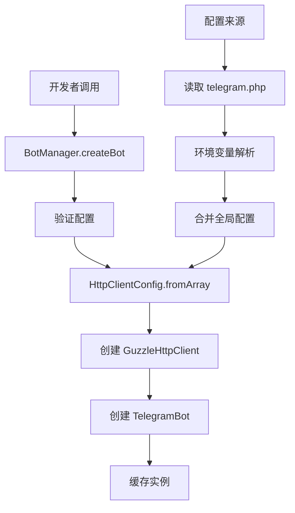

### 2.2 存在的问题

1. **配置分散**: HTTP 客户端配置、重试配置、代理配置等分散在多个层级
2. **重复代码**: 每次创建实例都需要重复的配置转换和验证过程
3. **硬编码依赖**: HttpClientConfig 和 GuzzleHttpClient 的强耦合
4. **配置复杂**: 开发者需要了解太多底层实现细节

### 2.3 配置文件分析

当前配置结构：

```php
'bots' => [
    'main' => [
        'token' => env('TELEGRAM_MAIN_BOT_TOKEN'),
        'base_url' => env('TELEGRAM_BASE_URL', 'https://api.telegram.org/bot'),
        'timeout' => (int) env('TELEGRAM_TIMEOUT', 30),
        'retry_attempts' => (int) env('TELEGRAM_RETRY_ATTEMPTS', 3),
        'retry_delay' => (int) env('TELEGRAM_RETRY_DELAY', 1000),
        // ... 更多 HTTP 客户端配置
    ]
]
```

## 3. 优化方案

### 3.1 配置结构重组

#### 3.1.1 分层配置设计

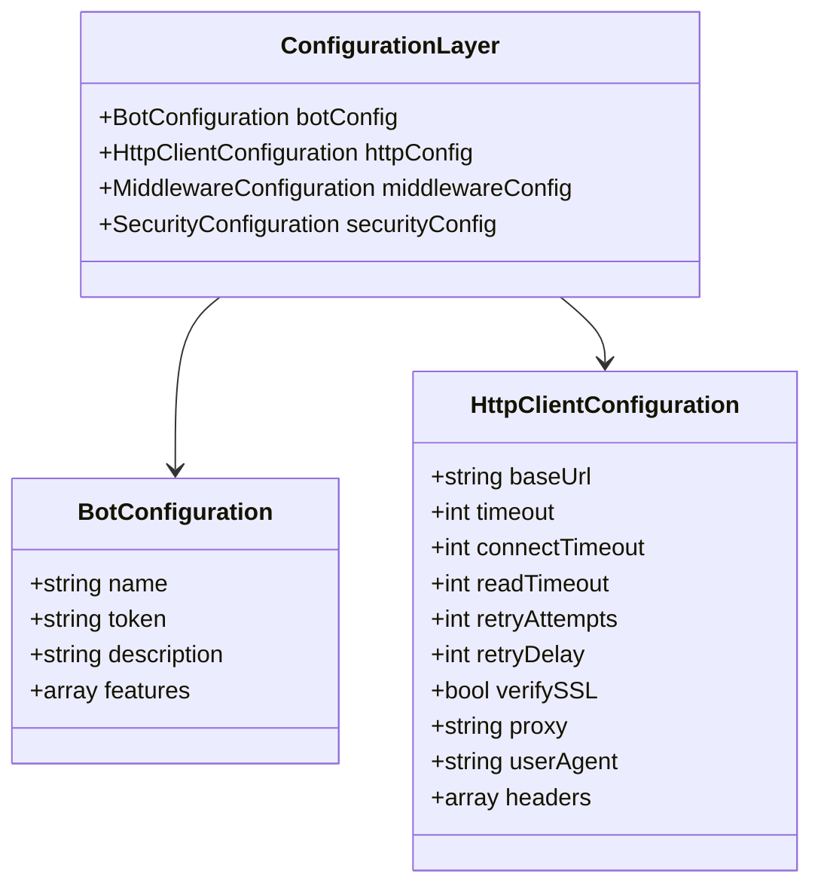

#### 3.1.2 新配置文件结构

```php
// config/telegram.php
return [
    'default' => 'main',
    
    // 全局 HTTP 客户端配置模板
    'http_client_templates' => [
        'standard' => [
            'timeout' => 30,
            'connect_timeout' => 10,
            'read_timeout' => 30,
            'retry_attempts' => 3,
            'retry_delay' => 1000,
            'verify_ssl' => true,
            'user_agent' => 'XBot-Telegram-SDK/1.0',
            'max_redirects' => 5,
            'debug' => false,
        ],
        'fast' => [
            'timeout' => 15,
            'connect_timeout' => 5,
            'read_timeout' => 15,
            'retry_attempts' => 2,
            'retry_delay' => 500,
        ],
        'reliable' => [
            'timeout' => 60,
            'connect_timeout' => 15,
            'read_timeout' => 60,
            'retry_attempts' => 5,
            'retry_delay' => 2000,
        ],
    ],
    
    'bots' => [
        'main' => [
            'token' => env('TELEGRAM_MAIN_BOT_TOKEN'),
            'http_template' => 'standard', // 使用预设模板
            'http_overrides' => [          // 覆盖特定配置
                'timeout' => 45,
            ],
        ],
        'customer-service' => [
            'token' => env('TELEGRAM_CS_BOT_TOKEN'),
            'http_template' => 'fast',
        ],
        'marketing' => [
            'token' => env('TELEGRAM_MARKETING_BOT_TOKEN'),
            'http_template' => 'reliable',
        ],
    ],
];
```

### 3.2 工厂模式优化

#### 3.2.1 配置工厂类

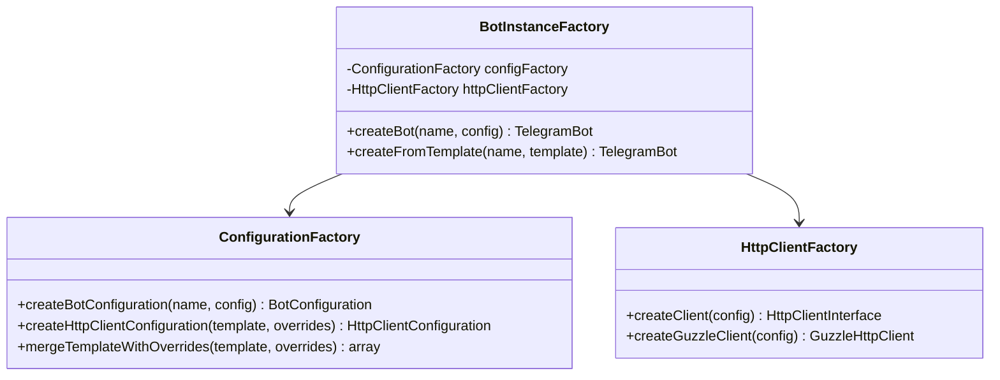

#### 3.2.2 简化的 BotManager

```php
class BotManager implements BotManagerInterface
{
    protected BotInstanceFactory $instanceFactory;
    protected ConfigurationFactory $configFactory;
    
    public function bot(string $name = null): TelegramBot
    {
        $botName = $name ?? $this->defaultBotName;
        
        if (isset($this->instances[$botName])) {
            return $this->instances[$botName];
        }
        
        // 使用工厂简化创建
        return $this->instanceFactory->createBot(
            $botName, 
            $this->getBotConfig($botName)
        );
    }
    
    public function createBotFromTemplate(string $name, string $template): TelegramBot
    {
        return $this->instanceFactory->createFromTemplate($name, $template);
    }
}
```

### 3.3 配置预设与模板

#### 3.3.1 预设配置类型

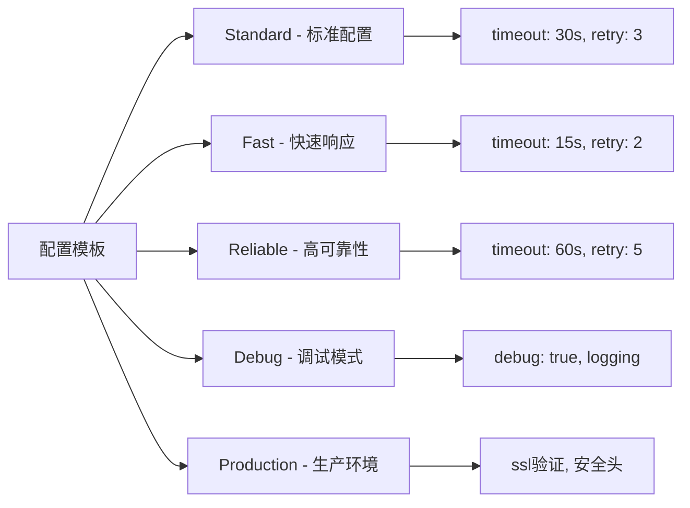

#### 3.3.2 智能配置合并

```php
class ConfigurationMerger
{
    public function mergeTemplateWithBotConfig(
        string $templateName, 
        array $botConfig, 
        array $globalConfig
    ): array {
        $template = $globalConfig['http_client_templates'][$templateName] ?? [];
        $overrides = $botConfig['http_overrides'] ?? [];
        $global = $globalConfig['global'] ?? [];
        
        return array_merge($template, $global, $overrides, [
            'token' => $botConfig['token'],
            'bot_name' => $botConfig['name'] ?? null,
        ]);
    }
}
```

### 3.4 Builder 模式支持

#### 3.4.1 流式配置构建器

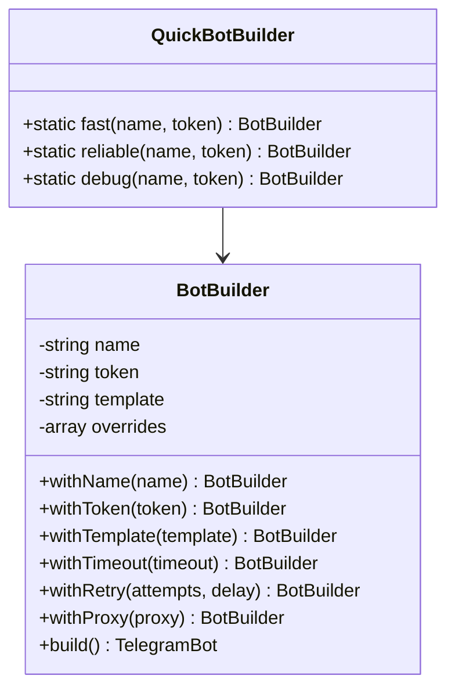

#### 3.4.2 使用示例

```php
// 传统方式
$config = [
    'token' => 'bot123:abc',
    'timeout' => 45,
    'retry_attempts' => 5,
    // ... 更多配置
];
$bot = $botManager->createBot('my-bot', $config);

// 优化后 - 使用模板
$bot = $botManager->createBotFromTemplate('my-bot', 'reliable');

// 优化后 - 使用构建器
$bot = BotBuilder::create()
    ->withName('my-bot')
    ->withToken('bot123:abc')
    ->withTemplate('standard')
    ->withTimeout(45)
    ->build();

// 优化后 - 快速构建
$bot = QuickBotBuilder::fast('my-bot', 'bot123:abc');
```

### 3.5 依赖注入优化

#### 3.5.1 ServiceProvider 增强

```php
class TelegramServiceProvider extends ServiceProvider
{
    public function register(): void
    {
        $this->registerConfigurationServices();
        $this->registerFactoryServices();
        $this->registerBotManager();
    }
    
    protected function registerConfigurationServices(): void
    {
        $this->app->singleton(ConfigurationFactory::class);
        $this->app->singleton(ConfigurationMerger::class);
    }
    
    protected function registerFactoryServices(): void
    {
        $this->app->singleton(HttpClientFactory::class);
        $this->app->singleton(BotInstanceFactory::class);
    }
}
```

#### 3.5.2 配置验证服务

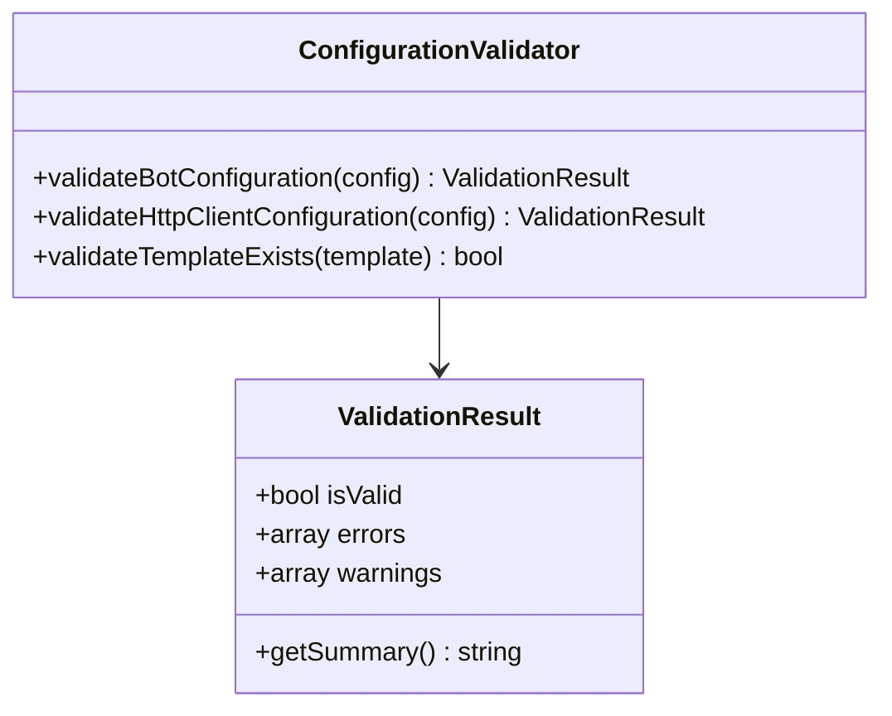

## 4. 实现细节

### 4.1 配置加载流程

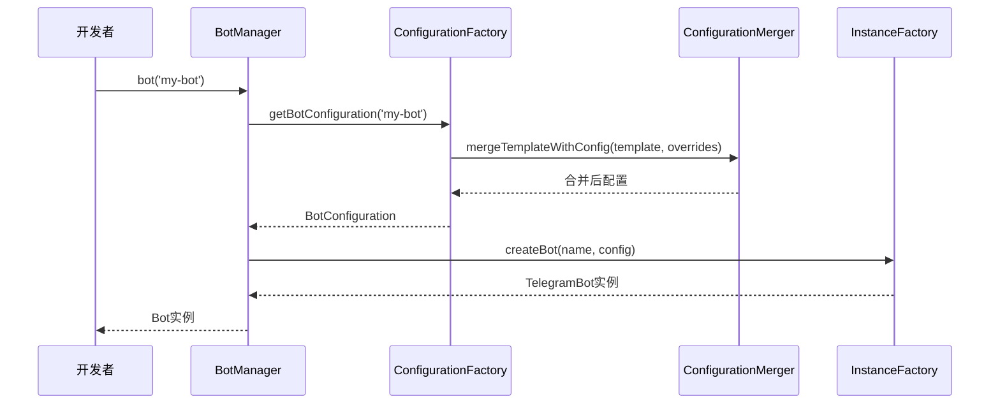

### 4.2 缓存策略优化

```php
class BotManager implements BotManagerInterface
{
    protected array $instances = [];
    protected array $configurations = [];
    
    public function bot(string $name = null): TelegramBot
    {
        $botName = $name ?? $this->defaultBotName;
        
        // 检查实例缓存
        if (isset($this->instances[$botName])) {
            return $this->instances[$botName];
        }
        
        // 检查配置缓存
        if (!isset($this->configurations[$botName])) {
            $this->configurations[$botName] = $this->configFactory
                ->createBotConfiguration($botName, $this->getRawBotConfig($botName));
        }
        
        // 创建实例
        $this->instances[$botName] = $this->instanceFactory
            ->createBot($botName, $this->configurations[$botName]);
            
        return $this->instances[$botName];
    }
}
```

### 4.3 错误处理改进

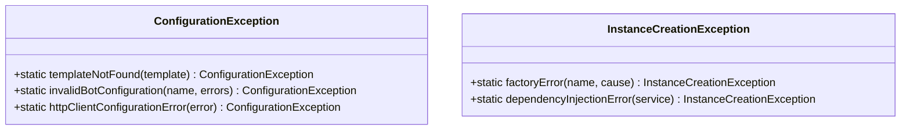

## 5. 性能优化

### 5.1 延迟加载策略

```php
class LazyBotManager implements BotManagerInterface
{
    protected array $instanceProxies = [];
    
    public function bot(string $name = null): TelegramBot
    {
        $botName = $name ?? $this->defaultBotName;
        
        if (!isset($this->instanceProxies[$botName])) {
            $this->instanceProxies[$botName] = new BotProxy(
                fn() => $this->createActualBot($botName)
            );
        }
        
        return $this->instanceProxies[$botName];
    }
}
```

### 5.2 配置预编译

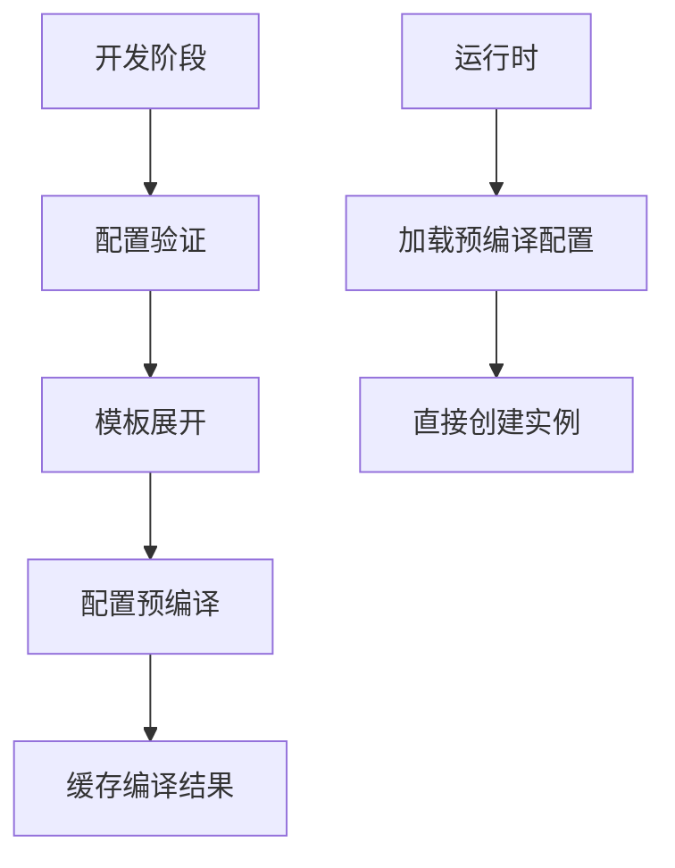

## 6. 向前兼容性

### 6.1 渐进式迁移

```php
class BotManager implements BotManagerInterface
{
    // 保持原有方法兼容
    public function createBot(string $name, array $config): TelegramBot
    {
        // 检测配置格式
        if ($this->isLegacyConfig($config)) {
            return $this->createBotLegacy($name, $config);
        }
        
        return $this->createBotOptimized($name, $config);
    }
    
    // 新的优化方法
    public function createBotFromTemplate(string $name, string $template): TelegramBot
    {
        return $this->instanceFactory->createFromTemplate($name, $template);
    }
}
```

### 6.2 配置迁移工具

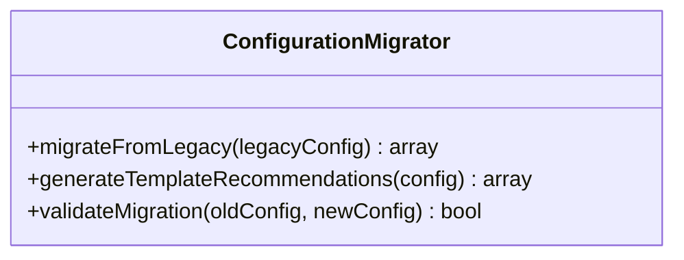

## 7. 测试策略

### 7.1 单元测试覆盖

```php
class ConfigurationFactoryTest extends TestCase
{
    public function testCreateBotConfigurationWithTemplate(): void
    {
        $factory = new ConfigurationFactory();
        $config = $factory->createBotConfiguration('test', [
            'token' => 'bot123:abc',
            'http_template' => 'fast',
        ]);
        
        $this->assertEquals('fast', $config->getHttpTemplate());
        $this->assertEquals(15, $config->getHttpConfig()->timeout);
    }
}
```

### 7.2 集成测试

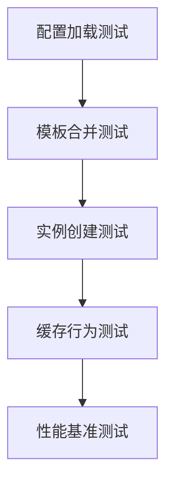
