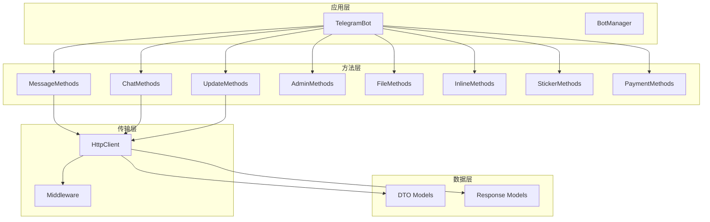
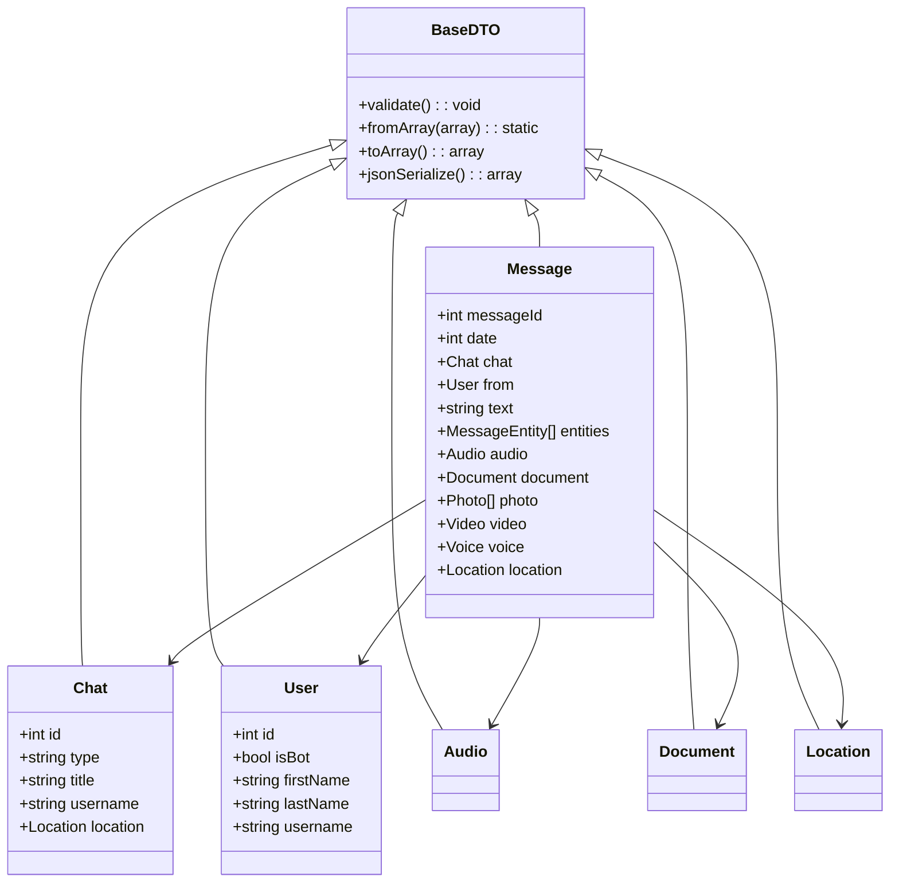

# telegram-sdk 缺失文件补齐设计文档

## 项目概述

telegram-sdk 是一个 PHP 的 Telegram Bot API 封装库，采用分层架构和模块化设计。通过对当前 src 目录的分析，发现项目中存在一些文件缺失问题，需要进行系统性的补齐。

## 当前架构分析

### 现有文件结构

```
src/
├── Console/Commands/           ✅ 完整 (4个命令文件)
├── Contracts/                 ⚠️ 需补充 
├── Exceptions/                ✅ 完整 (6个异常类)
├── Facades/                   ✅ 完整
├── Http/                      ⚠️ 需补充
├── Methods/                   ⚠️ 严重不完整
├── Models/                    ⚠️ 需补充
├── Providers/                 ✅ 完整
├── BotManager.php             ✅ 存在
└── TelegramBot.php            ✅ 存在
```

## 缺失文件分析

### 1. Contracts 接口缺失

**缺失问题**：

- `HttpClientConfig` 类在 `HttpClientInterface.php` 中定义但位置不规范
- 缺少独立的配置接口文件

**影响**：影响配置管理和依赖注入的规范性

### 2. Methods 方法组严重缺失

**现状分析**：
当前 `TelegramBot.php` 包含了大量 API 方法的直接实现，但缺少对应的方法组织结构。现有的 Methods 目录只有基础文件，缺少具体的方法组实现。

**缺失的方法组**：

- `AdminMethods.php` - 群组管理方法
- `FileMethods.php` - 文件操作方法
- `GameMethods.php` - 游戏相关方法
- `InlineMethods.php` - 内联查询方法
- `StickerMethods.php` - 贴纸相关方法
- `PassportMethods.php` - Telegram Passport 方法
- `PaymentMethods.php` - 支付相关方法

### 3. Models 模型缺失

**DTO 模型缺失**：

- `Animation.php` - 动画对象
- `Audio.php` - 音频对象
- `CallbackQuery.php` - 回调查询对象
- `Contact.php` - 联系人对象
- `Document.php` - 文档对象
- `File.php` - 文件对象
- `InlineQuery.php` - 内联查询对象
- `Location.php` - 位置对象
- `PhotoSize.php` - 照片尺寸对象
- `Sticker.php` - 贴纸对象
- `Video.php` - 视频对象
- `Voice.php` - 语音对象
- `Venue.php` - 场所对象
- `Poll.php` - 投票对象
- `Dice.php` - 骰子对象

**Response 模型缺失**：

- `PaginatedResponse.php` - 分页响应
- `FileResponse.php` - 文件响应
- `ApiResponse.php` - API 响应基类

### 4. HTTP 客户端补充

**缺失组件**：

- `Middleware/` 目录下的中间件实现
- 速率限制和重试机制的具体实现
- 文件上传的优化处理

## 补齐方案架构

### 整体架构优化



### 方法组重构策略

**设计原则**：

- 按功能领域分组（消息、聊天、管理、文件等）
- 每个方法组继承 `BaseMethodGroup`
- 提供流式接口和链式调用
- 统一的参数验证和错误处理

**重构后的调用方式**：

```php
// 原始方式（保持兼容）
$bot->sendMessage($chatId, $text);

// 新的方法组方式
$bot->message()->send($chatId, $text);
$bot->chat()->getAdministrators($chatId);
$bot->file()->upload($chatId, $filePath);
```

### 数据传输对象（DTO）扩展

**类型安全增强**：



## 文件补齐清单

### 优先级 1（核心功能）

#### Contracts 接口

- `HttpClientConfigInterface.php` - HTTP 客户端配置接口
- `MethodGroupInterface.php` - 方法组接口
- `DTOInterface.php` - DTO 基础接口

#### Methods 方法组

- `AdminMethods.php` - 群组管理（踢人、禁言、权限管理）
- `FileMethods.php` - 文件操作（上传、下载、获取信息）
- `InlineMethods.php` - 内联查询处理

#### Models/DTO 核心模型

- `Audio.php` - 音频文件模型
- `Document.php` - 文档文件模型
- `Location.php` - 位置信息模型
- `PhotoSize.php` - 图片尺寸模型
- `Video.php` - 视频文件模型
- `Voice.php` - 语音文件模型
- `CallbackQuery.php` - 回调查询模型
- `InlineQuery.php` - 内联查询模型

#### Models/Response 响应模型

- `PaginatedResponse.php` - 分页响应处理
- `FileResponse.php` - 文件响应处理

### 优先级 2（扩展功能）

#### Methods 扩展方法组

- `StickerMethods.php` - 贴纸管理
- `GameMethods.php` - 游戏功能
- `PaymentMethods.php` - 支付处理
- `PassportMethods.php` - 身份验证

#### Models/DTO 扩展模型

- `Animation.php` - GIF 动画模型
- `Contact.php` - 联系人模型
- `Sticker.php` - 贴纸模型
- `Poll.php` - 投票模型
- `Dice.php` - 骰子模型
- `Venue.php` - 场所模型
- `File.php` - 通用文件模型

#### HTTP 中间件

- `Http/Middleware/RequestLogger.php` - 请求日志中间件
- `Http/Middleware/RetryHandler.php` - 重试处理中间件
- `Http/Middleware/ResponseCache.php` - 响应缓存中间件

### 优先级 3（高级功能）

#### Utils 工具类

- `Utils/FileHelper.php` - 文件操作工具
- `Utils/ValidationHelper.php` - 数据验证工具
- `Utils/FormatHelper.php` - 格式化工具

#### Events 事件系统

- `Events/MessageReceived.php` - 消息接收事件
- `Events/CallbackReceived.php` - 回调接收事件
- `Events/InlineQueryReceived.php` - 内联查询事件

## 实现细节

### 方法组实现模式

```php
abstract class BaseMethodGroup {
    protected HttpClientInterface $httpClient;
    protected string $botName;
    
    protected function call(string $method, array $parameters = []): ServerResponse
    protected function upload(string $method, array $parameters = [], array $files = []): ServerResponse
    protected function validateRequired(array $parameters, array $required): void
}

class AdminMethods extends BaseMethodGroup {
    public function kickChatMember(int|string $chatId, int $userId): bool
    public function banChatMember(int|string $chatId, int $userId, array $options = []): bool
    public function unbanChatMember(int|string $chatId, int $userId): bool
    public function restrictChatMember(int|string $chatId, int $userId, array $permissions): bool
    public function promoteChatMember(int|string $chatId, int $userId, array $privileges = []): bool
    public function setChatAdministratorCustomTitle(int|string $chatId, int $userId, string $customTitle): bool
    public function banChatSenderChat(int|string $chatId, int $senderChatId): bool
    public function unbanChatSenderChat(int|string $chatId, int $senderChatId): bool
}
```

### DTO 模型实现模式

```php
class Audio extends BaseDTO {
    public function __construct(
        public readonly string $fileId,
        public readonly string $fileUniqueId,
        public readonly int $duration,
        public readonly ?string $performer = null,
        public readonly ?string $title = null,
        public readonly ?string $fileName = null,
        public readonly ?string $mimeType = null,
        public readonly ?int $fileSize = null,
        public readonly ?PhotoSize $thumbnail = null
    ) {
        parent::__construct();
    }
    
    public function isMusic(): bool {
        return !empty($this->performer) || !empty($this->title);
    }
    
    public function getDurationFormatted(): string {
        $minutes = floor($this->duration / 60);
        $seconds = $this->duration % 60;
        return sprintf('%02d:%02d', $minutes, $seconds);
    }
}
```

### 响应模型实现

```php
class PaginatedResponse {
    public function __construct(
        private array $items,
        private int $offset,
        private int $limit,
        private bool $hasMore
    ) {}
    
    public function getItems(): array { return $this->items; }
    public function getOffset(): int { return $this->offset; }
    public function getLimit(): int { return $this->limit; }
    public function hasMore(): bool { return $this->hasMore; }
    public function getNextOffset(): ?int { 
        return $this->hasMore ? $this->offset + $this->limit : null; 
    }
}
```

## 向后兼容性保证

### 渐进式重构策略

1. **保持现有API**：`TelegramBot` 类的现有方法保持不变
2. **新增方法组访问器**：添加 `message()`、`chat()`、`admin()` 等方法
3. **内部重构**：逐步将 `TelegramBot` 的方法委托给对应的方法组
4. **软弃用**：对老方法添加 `@deprecated` 注释，但保持功能

### 兼容性实现

```php
class TelegramBot {
    private ?MessageMethods $messageMethods = null;
    private ?ChatMethods $chatMethods = null;
    private ?AdminMethods $adminMethods = null;
    
    // 新的方法组访问器
    public function message(): MessageMethods {
        return $this->messageMethods ??= new MessageMethods($this->httpClient, $this->name);
    }
    
    public function admin(): AdminMethods {
        return $this->adminMethods ??= new AdminMethods($this->httpClient, $this->name);
    }
    
    // 保持现有方法（内部委托给方法组）
    public function sendMessage(int|string $chatId, string $text, array $options = []): Message {
        return $this->message()->send($chatId, $text, $options);
    }
    
    public function kickChatMember(int|string $chatId, int $userId): bool {
        return $this->admin()->kickChatMember($chatId, $userId);
    }
}
```

## 测试策略

### 单元测试补充

每个新增的类都需要相应的测试文件：

```
tests/Unit/
├── Methods/
│   ├── AdminMethodsTest.php
│   ├── FileMethodsTest.php
│   └── InlineMethodsTest.php
├── Models/DTO/
│   ├── AudioTest.php
│   ├── DocumentTest.php
│   └── LocationTest.php
└── Models/Response/
    ├── PaginatedResponseTest.php
    └── FileResponseTest.php
```

### 集成测试增强

验证方法组与主类的集成：

```php
class TelegramBotIntegrationTest extends TestCase {
    public function test_method_groups_integration() {
        $bot = $this->createBot();
        
        // 测试新方法组调用
        $this->assertInstanceOf(MessageMethods::class, $bot->message());
        $this->assertInstanceOf(AdminMethods::class, $bot->admin());
        
        // 测试向后兼容性
        $message1 = $bot->sendMessage($chatId, $text);
        $message2 = $bot->message()->send($chatId, $text);
        $this->assertEquals($message1->messageId, $message2->messageId);
    }
}
```
