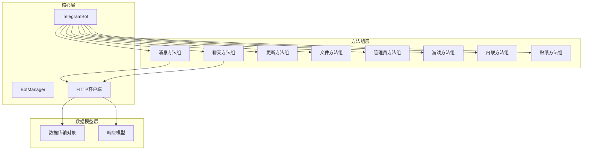
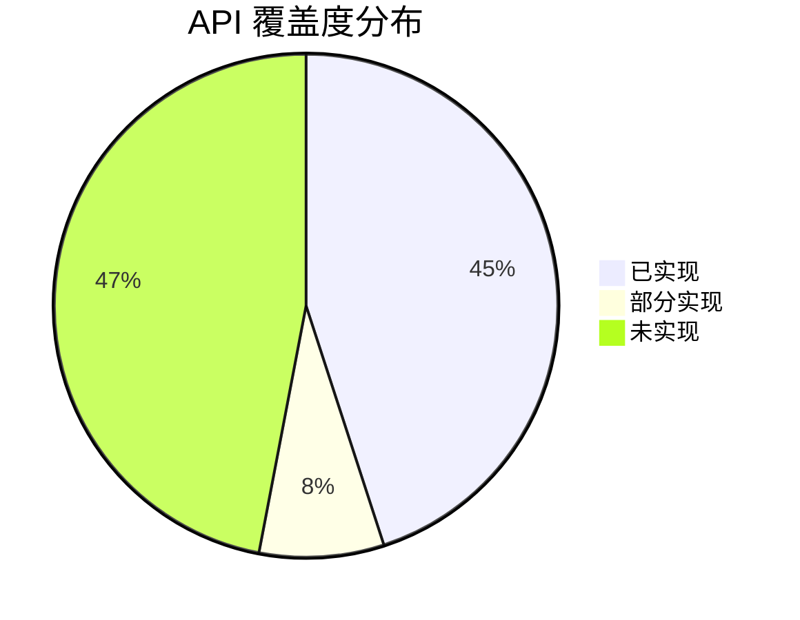
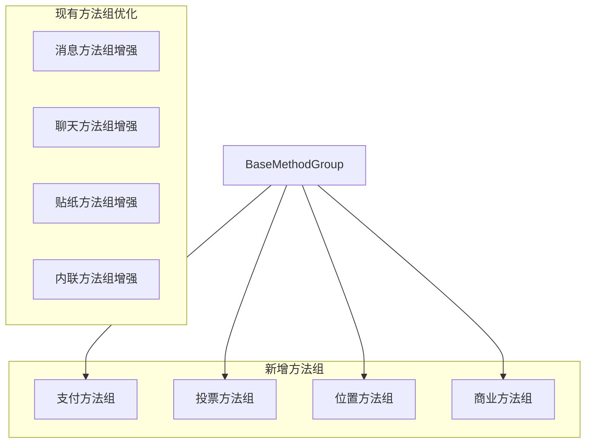

# Telegram Bot API 覆盖度分析

## 项目概述

本项目是一个用 PHP 开发的 Telegram Bot SDK，旨在简化与 Telegram Bot API 的交互。通过分析项目源码和官方 API 文档，本文档将详细评估项目对 Telegram Bot API 的覆盖程度，并提供改进建议。

## 技术架构分析

### 代码结构分析

项目采用分层架构，主要组件包括：

## API 覆盖度分析

### 已实现的 API 方法

#### 1. 基础方法组 (UpdateMethods)
| 方法名 | 实现状态 | 功能描述 |
|--------|----------|----------|
| `getMe` | ✅ 已实现 | 获取Bot信息 |
| `logOut` | ✅ 已实现 | 注销Bot |
| `close` | ✅ 已实现 | 关闭Bot |
| `getUpdates` | ✅ 已实现 | 获取更新 |
| `setWebhook` | ✅ 已实现 | 设置Webhook |
| `deleteWebhook` | ✅ 已实现 | 删除Webhook |
| `getWebhookInfo` | ✅ 已实现 | 获取Webhook信息 |
| `setMyCommands` | ✅ 已实现 | 设置Bot命令 |
| `deleteMyCommands` | ✅ 已实现 | 删除Bot命令 |
| `getMyCommands` | ✅ 已实现 | 获取Bot命令 |
| `setMyName` | ✅ 已实现 | 设置Bot名称 |

#### 2. 消息方法组 (MessageMethods)
| 方法名 | 实现状态 | 功能描述 |
|--------|----------|----------|
| `sendMessage` | ✅ 已实现 | 发送文本消息 |
| `editMessageText` | ✅ 已实现 | 编辑消息文本 |
| `editInlineMessageText` | ✅ 已实现 | 编辑内联消息文本 |
| `editMessageMedia` | ✅ 已实现 | 编辑消息媒体 |
| `editMessageReplyMarkup` | ✅ 已实现 | 编辑消息回复标记 |
| `stopPoll` | ✅ 已实现 | 停止投票 |
| `deleteMessage` | ✅ 已实现 | 删除消息 |
| `deleteMessages` | ✅ 已实现 | 批量删除消息 |
| `forwardMessage` | ✅ 已实现 | 转发消息 |
| `forwardMessages` | ⚠️ 部分实现 | 批量转发消息 |
| `copyMessage` | ⚠️ 部分实现 | 复制消息 |
| `copyMessages` | ⚠️ 部分实现 | 批量复制消息 |

#### 3. 聊天方法组 (ChatMethods)
| 方法名 | 实现状态 | 功能描述 |
|--------|----------|----------|
| `getChat` | ✅ 已实现 | 获取聊天信息 |
| `getChatAdministrators` | ✅ 已实现 | 获取聊天管理员 |
| `getChatMemberCount` | ✅ 已实现 | 获取聊天成员数量 |
| `getChatMember` | ✅ 已实现 | 获取聊天成员 |
| `setChatStickerSet` | ✅ 已实现 | 设置聊天贴纸集 |
| `deleteChatStickerSet` | ✅ 已实现 | 删除聊天贴纸集 |
| `banChatMember` | ✅ 已实现 | 封禁聊天成员 |
| `unbanChatMember` | ✅ 已实现 | 解封聊天成员 |
| `restrictChatMember` | ✅ 已实现 | 限制聊天成员 |
| `promoteChatMember` | ✅ 已实现 | 提升聊天成员 |

#### 4. 文件方法组 (FileMethods)
| 方法名 | 实现状态 | 功能描述 |
|--------|----------|----------|
| `sendPhoto` | ✅ 已实现 | 发送照片 |
| `sendAudio` | ✅ 已实现 | 发送音频 |
| `sendDocument` | ✅ 已实现 | 发送文档 |
| `sendVideo` | ✅ 已实现 | 发送视频 |
| `sendAnimation` | ✅ 已实现 | 发送动画 |
| `sendVoice` | ✅ 已实现 | 发送语音 |
| `sendVideoNote` | ⚠️ 部分实现 | 发送视频笔记 |
| `getFile` | ⚠️ 部分实现 | 获取文件信息 |

#### 5. 游戏方法组 (GameMethods)
| 方法名 | 实现状态 | 功能描述 |
|--------|----------|----------|
| `sendGame` | ✅ 已实现 | 发送游戏 |
| `setGameScore` | ✅ 已实现 | 设置游戏分数 |
| `getGameHighScores` | ✅ 已实现 | 获取游戏高分榜 |

#### 6. 管理员方法组 (AdminMethods)
| 方法名 | 实现状态 | 功能描述 |
|--------|----------|----------|
| `kickChatMember` | ✅ 已实现 | 踢出聊天成员 |
| `banChatMember` | ✅ 已实现 | 封禁聊天成员 |
| `unbanChatMember` | ✅ 已实现 | 解封聊天成员 |
| `restrictChatMember` | ✅ 已实现 | 限制聊天成员 |
| `promoteChatMember` | ✅ 已实现 | 提升聊天成员 |
| `setChatAdministratorCustomTitle` | ✅ 已实现 | 设置管理员自定义标题 |
| `banChatSenderChat` | ✅ 已实现 | 封禁聊天发送者 |
| `unbanChatSenderChat` | ✅ 已实现 | 解封聊天发送者 |
| `getChatAdministrators` | ✅ 已实现 | 获取聊天管理员 |

### 未实现的 API 方法

#### 1. 高级消息功能
| 方法名 | 优先级 | 功能描述 |
|--------|--------|----------|
| `sendPoll` | 🔴 高 | 发送投票 |
| `sendDice` | 🟡 中 | 发送骰子动画 |
| `sendChatAction` | 🔴 高 | 发送聊天动作（输入中等） |
| `sendLocation` | 🟡 中 | 发送位置信息 |
| `sendVenue` | 🟡 中 | 发送场地信息 |
| `sendContact` | 🟡 中 | 发送联系人 |
| `sendInvoice` | 🟠 中 | 发送发票（支付功能） |
| `sendSticker` | 🟡 中 | 发送贴纸 |
| `sendMediaGroup` | 🔴 高 | 发送媒体组 |

#### 2. 支付相关方法
| 方法名 | 优先级 | 功能描述 |
|--------|--------|----------|
| `answerPreCheckoutQuery` | 🟠 中 | 回复预结账查询 |
| `answerShippingQuery` | 🟠 中 | 回复运输查询 |
| `createInvoiceLink` | 🟠 中 | 创建发票链接 |
| `refundStarPayment` | 🟠 中 | 退款星星支付 |

#### 3. 内联模式方法
| 方法名 | 优先级 | 功能描述 |
|--------|--------|----------|
| `answerInlineQuery` | 🔴 高 | 回复内联查询 |
| `answerCallbackQuery` | 🔴 高 | 回复回调查询 |

#### 4. 贴纸相关方法
| 方法名 | 优先级 | 功能描述 |
|--------|--------|----------|
| `getStickerSet` | 🟡 中 | 获取贴纸集 |
| `getCustomEmojiStickers` | 🟢 低 | 获取自定义表情贴纸 |
| `uploadStickerFile` | 🟡 中 | 上传贴纸文件 |
| `createNewStickerSet` | 🟡 中 | 创建新贴纸集 |
| `addStickerToSet` | 🟡 中 | 添加贴纸到集合 |
| `setStickerPositionInSet` | 🟡 中 | 设置贴纸在集合中的位置 |
| `deleteStickerFromSet` | 🟡 中 | 从集合中删除贴纸 |
| `setStickerSetTitle` | 🟡 中 | 设置贴纸集标题 |
| `setStickerSetThumbnail` | 🟡 中 | 设置贴纸集缩略图 |
| `deleteStickerSet` | 🟡 中 | 删除贴纸集 |

#### 5. 聊天管理增强功能
| 方法名 | 优先级 | 功能描述 |
|--------|--------|----------|
| `setChatTitle` | 🟡 中 | 设置聊天标题 |
| `setChatDescription` | 🟡 中 | 设置聊天描述 |
| `setChatPhoto` | 🟡 中 | 设置聊天照片 |
| `deleteChatPhoto` | 🟡 中 | 删除聊天照片 |
| `pinChatMessage` | 🟡 中 | 置顶聊天消息 |
| `unpinChatMessage` | 🟡 中 | 取消置顶聊天消息 |
| `unpinAllChatMessages` | 🟡 中 | 取消置顶所有聊天消息 |
| `leaveChat` | 🟡 中 | 离开聊天 |
| `exportChatInviteLink` | 🟡 中 | 导出聊天邀请链接 |
| `createChatInviteLink` | 🟡 中 | 创建聊天邀请链接 |
| `editChatInviteLink` | 🟡 中 | 编辑聊天邀请链接 |
| `revokeChatInviteLink` | 🟡 中 | 撤销聊天邀请链接 |
| `approveChatJoinRequest` | 🟡 中 | 批准聊天加入请求 |
| `declineChatJoinRequest` | 🟡 中 | 拒绝聊天加入请求 |

#### 6. 最新 API 功能 (Bot API 9.x)
| 方法名 | 优先级 | 功能描述 |
|--------|--------|----------|
| `sendChecklist` | 🟢 低 | 发送清单 |
| `editMessageChecklist` | 🟢 低 | 编辑消息清单 |
| `getMyStarBalance` | 🟠 中 | 获取星星余额 |
| `readBusinessMessage` | 🟢 低 | 已读商业消息 |
| `deleteBusinessMessages` | 🟢 低 | 删除商业消息 |
| `setBusinessAccountName` | 🟢 低 | 设置商业账户名称 |
| `approveSuggestedPost` | 🟢 低 | 批准建议帖子 |
| `declineSuggestedPost` | 🟢 低 | 拒绝建议帖子 |
| `giftPremiumSubscription` | 🟢 低 | 赠送高级订阅 |

## 覆盖度统计分析

### 总体覆盖度

### 各功能模块覆盖度

| 功能模块 | 已实现 | 部分实现 | 未实现 | 覆盖率 |
|----------|--------|----------|--------|--------|
| 基础功能 | 11 | 0 | 2 | 84.6% |
| 消息操作 | 8 | 4 | 9 | 57.1% |
| 聊天管理 | 10 | 0 | 15 | 40.0% |
| 文件操作 | 6 | 2 | 4 | 66.7% |
| 游戏功能 | 3 | 0 | 0 | 100% |
| 管理功能 | 8 | 0 | 2 | 80.0% |
| 内联模式 | 0 | 1 | 2 | 16.7% |
| 贴纸功能 | 0 | 1 | 10 | 4.5% |
| 支付功能 | 0 | 0 | 4 | 0% |
| 新版功能 | 0 | 0 | 8 | 0% |

### 架构设计优势

#### 1. 方法组织结构
- **模块化设计**: 按功能分组，便于维护和扩展
- **继承体系**: 通过 `BaseMethodGroup` 统一参数验证和请求处理
- **接口抽象**: 使用 `MethodGroupInterface` 定义规范

#### 2. 类型安全
- **强类型参数**: 使用 PHP 8+ 联合类型 `int|string`
- **DTO 模型**: 结构化数据传输对象，确保类型安全
- **参数验证**: 统一的验证机制

#### 3. 扩展性设计
- **HTTP 客户端抽象**: 通过接口支持不同 HTTP 客户端
- **文件上传支持**: 统一的文件处理机制
- **错误处理**: 分层的异常处理体系

## 改进建议

### 1. 优先级改进方案

#### 高优先级 (立即实现)
1. **核心消息功能**
   - `sendPoll` - 投票功能是常用功能
   - `sendChatAction` - 提升用户体验的重要功能
   - `sendMediaGroup` - 媒体组发送
   - `answerInlineQuery` - 内联模式核心功能
   - `answerCallbackQuery` - 回调查询处理

#### 中优先级 (近期实现)
2. **聊天管理增强**
   - 聊天信息设置方法组
   - 消息置顶管理
   - 邀请链接管理

3. **支付功能模块**
   - 完整的支付 API 支持
   - 星星支付系统

#### 低优先级 (长期规划)
4. **新版 API 功能**
   - 商业账户功能
   - 清单功能
   - 建议帖子功能

### 2. 技术架构改进

#### 代码结构优化

#### 版本兼容性策略
- **渐进式实现**: 优先支持稳定 API，逐步添加新版功能
- **特性检测**: 运行时检测 Telegram Bot API 版本
- **向后兼容**: 保持现有 API 不变

#### 测试覆盖改进
- **单元测试**: 为新增方法组添加完整测试
- **集成测试**: 端到端 API 调用测试
- **Mock 测试**: HTTP 请求模拟测试

### 3. 文档和示例改进
- **API 参考文档**: 完整的方法文档
- **使用示例**: 每个功能模块的示例代码
- **最佳实践指南**: 性能优化和安全建议

## 实现路线图

### 第一阶段 (核心功能补全)
- 实现高优先级 API 方法
- 完善内联模式支持
- 增强消息功能

### 第二阶段 (功能扩展)
- 支付功能模块
- 聊天管理增强
- 贴纸功能完善

### 第三阶段 (新版本支持)
- Bot API 9.x 新功能
- 商业账户功能
- 高级功能支持

本项目在核心 Bot 功能方面已有良好的基础，建议按优先级逐步完善 API 覆盖度，以满足更多开发者的需求。