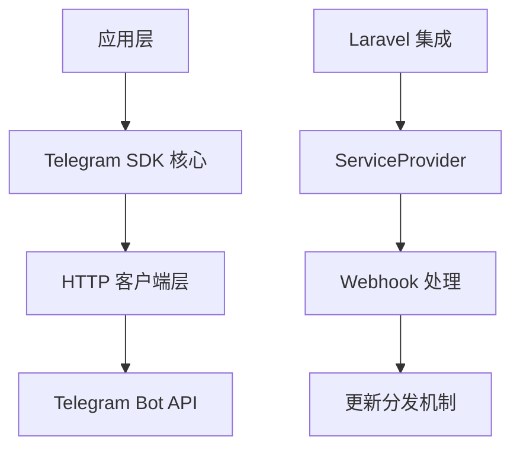

# Telegram Bot PHP SDK 项目导向文档

## 1. 概述

Telegram Bot PHP SDK 是一个经过重大重构的 Telegram Bot API 封装库。重构后的项目专注于提供简洁、高效的 API 交互体验，回归到做好 SDK 本身功能的初心。

### 1.1 重构目标

- 简化项目架构，专注于核心功能
- 提供更直观的 API 调用方式
- 优化与 Telegram Bot API 的交互体验
- 保持对 Laravel 框架的良好集成

## 2. 技术架构

### 2.1 架构设计

项目采用清晰的分层架构设计：



### 2.2 核心组件

#### 2.2.1 Telegram 基类
作为 SDK 的核心抽象类，提供基础功能：
- API 端点动态调用
- HTTP 客户端管理
- 调用统计信息收集
- 配置管理

#### 2.2.2 Bot 工厂类
提供便捷的 Bot 实例创建方法：
- `Bot::token()` 快速创建实例
- 自动生成唯一实例名称

#### 2.2.3 API 端点类
每个 Telegram API 方法对应一个独立类：
- 继承自 `BaseEndpoint`
- 实现具体业务逻辑
- 内置参数验证机制

#### 2.2.4 HTTP 客户端
负责与 Telegram 服务器通信：
- 基于 Guzzle 实现
- 支持文件上传
- 错误重试机制

## 3. 项目结构

```
src/
├── API/                    # Telegram API 端点实现
├── Bot.php                 # Bot 实例工厂类
├── Console/                # CLI 命令
├── Contracts/              # 接口定义
├── Events/                 # Laravel 事件
├── Exceptions/             # 异常类
├── Handlers/               # 更新处理器
├── Http/                   # HTTP 相关组件
│   ├── Client/             # HTTP 客户端实现
│   ├── Controllers/        # 控制器
│   ├── Middleware/         # 中间件
│   └── Response/           # 响应处理
├── Inline/                 # Inline 键盘组件
├── Keyboard/               # 键盘组件
├── Providers/              # Laravel 服务提供者
├── Telegram.php            # Telegram 基类
├── TelegramBot.php         # TelegramBot 类（向后兼容）
└── Utils/                  # 工具类
```

## 4. API 调用机制

### 4.1 调用方式

SDK 通过魔术方法 `__call()` 实现动态 API 调用：

```php
// 创建 Bot 实例
$bot = Bot::token('YOUR_BOT_TOKEN');

// 调用 API 方法
$me = $bot->getMe();
$message = $bot->sendMessage($chatId, 'Hello World');
```

### 4.2 端点解析

当调用 `$bot->sendMessage()` 时，系统会：
1. 将方法名转换为 StudlyCase 格式（sendMessage → SendMessage）
2. 查找对应的 API 端点类（`XBot\Telegram\API\SendMessage`）
3. 创建端点实例并执行调用

### 4.3 参数处理

API 端点类负责参数处理：
- 验证必要参数
- 格式化参数类型
- 处理可选参数

```php
// SendMessage 端点的实现
final class SendMessage extends BaseEndpoint
{
    public function __invoke(int|string $chatId, string $text, array $options = []): \XBot\Telegram\Http\Response\Transformer
    {
        // 参数验证
        $this->validateChatId($chatId);
        $this->validateTextLength($text, 4096);

        // 参数准备
        $parameters = $this->prepareParameters(array_merge([
            'chat_id' => $chatId,
            'text'    => $text,
        ], $options));

        // 执行调用
        $response = $this->call('sendMessage', $parameters)->ensureOk();
        return $this->formatResult($response->getResult());
    }
}
```

## 5. 响应处理

### 5.1 Transformer 模式

API 调用返回 Transformer 对象，支持多种格式输出：

```php
$response = $bot->getMe();

// 获取数组格式
$array = $response->toArray();

// 获取对象格式
$obj = $response->toObject();

// 获取 JSON 格式
$json = $response->toJson();
```

### 5.2 错误处理

SDK 提供完善的错误处理机制：
- HTTP 层错误处理
- Telegram API 错误解析
- 异常类型分类

## 6. Webhook 机制

### 6.1 Laravel 集成

SDK 提供完整的 Laravel 集成支持：
- 自动注册 Webhook 路由
- 请求验证中间件
- 更新分发机制

### 6.2 更新处理

支持灵活的更新处理方式：
- 基础更新处理器
- 命令路由器
- 自定义处理逻辑

### 6.3 配置说明

配置文件明确指出："已放弃多实例配置，如需多实例请自行扩展"，表明项目重构后专注于单实例使用场景。

## 7. 扩展机制

### 7.1 自定义 HTTP 客户端

通过实现 `Client` 接口可以替换默认的 HTTP 客户端实现。

### 7.2 自定义端点

可以扩展新的 API 端点以支持 Telegram 的新功能。

### 7.3 配置扩展

支持通过配置文件和环境变量进行灵活配置。

## 8. 历史遗留代码清理

### 8.1 空目录清理
项目中存在以下历史遗留的空目录，建议清理：
- `src/Facades/` - 空目录
- `src/Fluent/` - 空目录
- `src/Methods/` - 空目录
- `src/Models/` - 空目录（包含空的子目录）

### 8.2 文档更新
需要更新以下文档以移除对历史结构的引用：
- `AGENTS.md` - 移除对 Facades 和 Models 目录的描述
- `api_coverage_analysis.md` - 更新架构图和描述以匹配当前结构

### 8.3 向后兼容性
`src/TelegramBot.php` 文件仅作为向后兼容的别名类，如果不需要兼容旧版本，可以考虑删除。