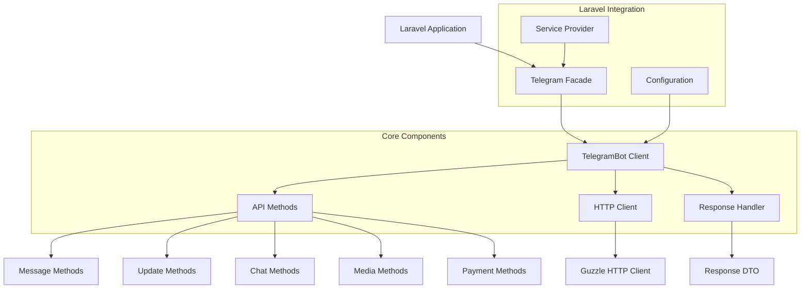
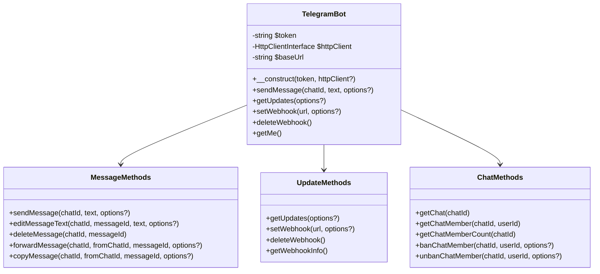
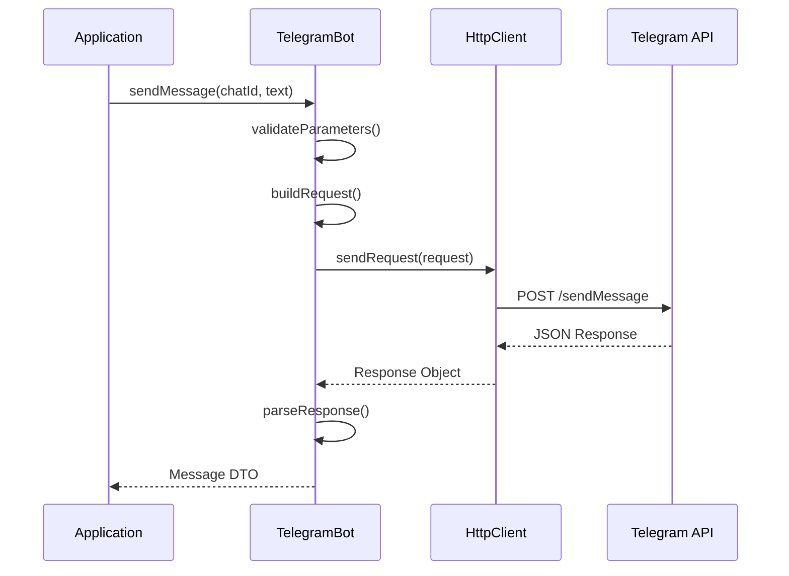
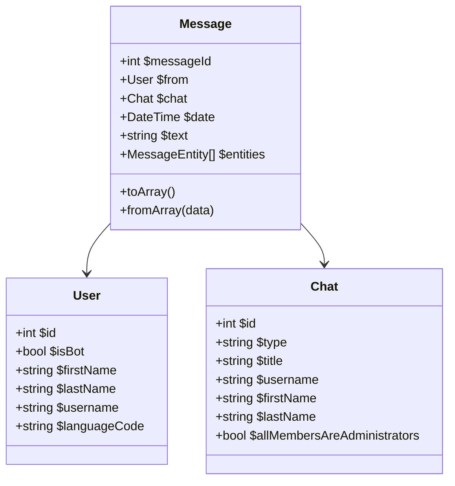
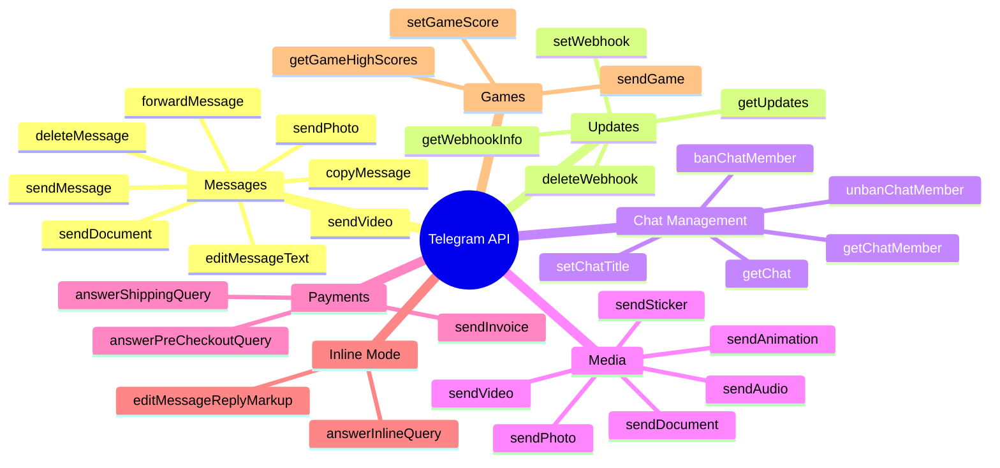
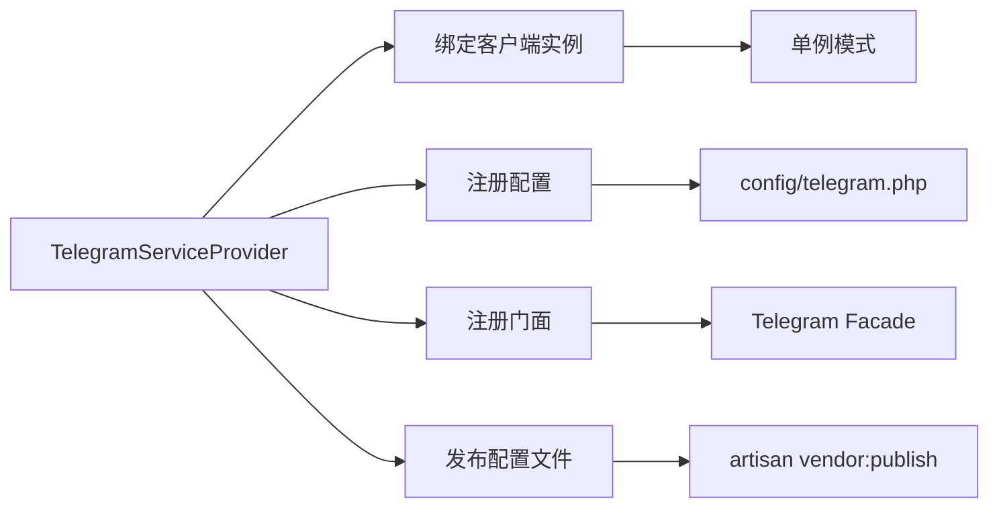
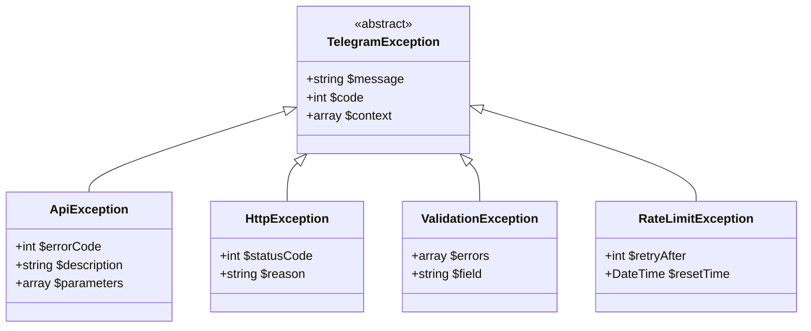
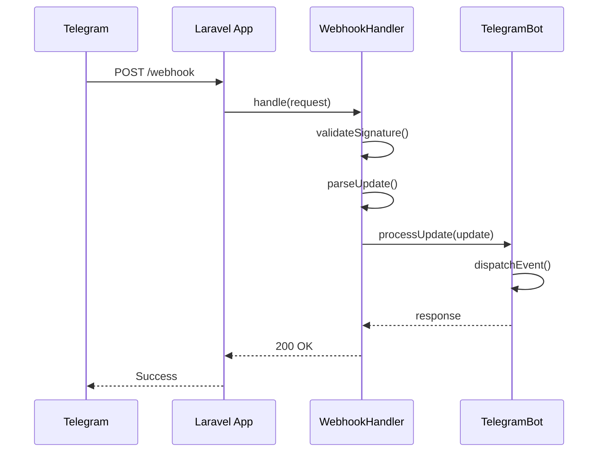
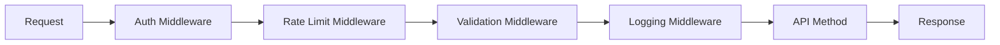
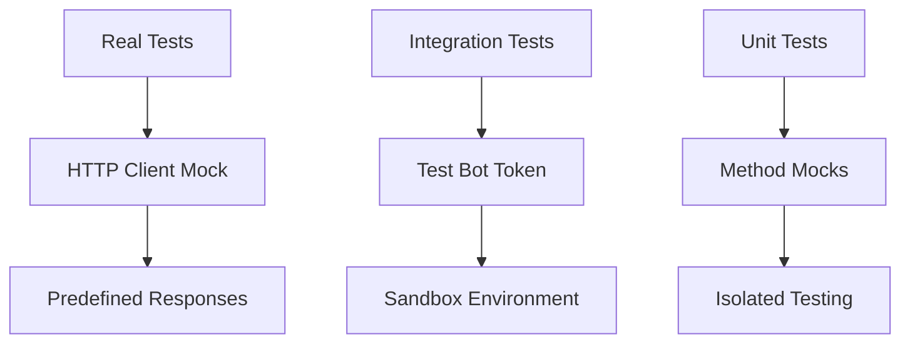

# Telegram Bot PHP SDK 设计文档

## 概述

Telegram Bot PHP SDK 是一个轻量级、易用的 PHP 库，旨在简化开发者与 Telegram Bot API 的集成。该 SDK 为 PHP 开发者提供了完整的 Telegram Bot API 封装，支持所有官方 API 方法，并提供了优雅的 Laravel 集成。

### 核心目标
- 提供完整的 Telegram Bot API 封装
- 支持现代 PHP 特性（PHP 8.3+）
- 遵循 PSR 标准和最佳实践
- 提供优雅的 Laravel 集成
- 支持异步操作和高性能 HTTP 客户端
- 提供类型安全的 API 调用

### 技术栈
- **语言**: PHP 8.3+
- **HTTP 客户端**: Guzzle 7.10+
- **框架集成**: Laravel 11/12
- **测试框架**: PestPHP 4.0
- **代码质量**: PHPStan + Larastan

## 架构设计

### 整体架构



### 分层架构

| 层级 | 组件 | 职责 |
|------|------|------|
| **门面层** | Telegram Facade | 提供静态访问接口，简化使用 |
| **客户端层** | TelegramBot Client | 核心客户端，管理认证和请求 |
| **方法层** | API Methods | 封装具体的 Telegram API 方法 |
| **传输层** | HTTP Client | 处理 HTTP 请求和响应 |
| **数据层** | DTO/Models | 数据传输对象和模型定义 |

## 核心组件设计

### 1. TelegramBot 客户端



### 2. HTTP 客户端封装



### 3. 响应处理机制

| 响应类型 | 处理方式 | 返回值 |
|----------|----------|--------|
| **成功响应** | 解析 result 字段 | 对应的 DTO 对象 |
| **错误响应** | 抛出 TelegramException | - |
| **网络错误** | 抛出 HttpException | - |
| **超时** | 重试机制 + 异常 | - |

### 4. 数据传输对象（DTO）



## API 方法组织

### 方法分类



### 方法实现模式

| 方法类型 | 实现模式 | 示例 |
|----------|----------|------|
| **简单方法** | 直接 HTTP 调用 | `getMe()`, `deleteWebhook()` |
| **参数丰富** | 构建器模式 | `sendMessage()`, `editMessageText()` |
| **文件上传** | 多部分表单 | `sendPhoto()`, `sendDocument()` |
| **批量操作** | 数组参数 | `sendMediaGroup()` |

## Laravel 集成

### 服务提供者架构



### 配置管理

| 配置项 | 类型 | 说明 | 默认值 |
|--------|------|------|--------|
| `token` | string | Bot Token | 环境变量 |
| `base_url` | string | API 基础 URL | `https://api.telegram.org/bot` |
| `timeout` | int | 请求超时时间（秒） | 30 |
| `retry_attempts` | int | 重试次数 | 3 |
| `retry_delay` | int | 重试延迟（毫秒） | 1000 |

### 门面使用模式

```php
// 基础使用
Telegram::sendMessage($chatId, 'Hello World!');

// 链式调用
Telegram::to($chatId)
    ->message('Hello!')
    ->keyboard($keyboard)
    ->send();

// 文件发送
Telegram::sendPhoto($chatId, $photo, 'Caption');
```

## 错误处理策略

### 异常层次结构



### 错误处理流程

| 错误类型 | HTTP 状态码 | 处理策略 |
|----------|-------------|----------|
| **参数错误** | 400 | 抛出 ValidationException |
| **认证失败** | 401 | 抛出 ApiException |
| **权限不足** | 403 | 抛出 ApiException |
| **资源不存在** | 404 | 抛出 ApiException |
| **请求过于频繁** | 429 | 实现退避重试 |
| **服务器错误** | 5xx | 重试机制 |

## 高级特性

### 1. Webhook 处理



### 2. 中间件系统



### 3. 事件系统

| 事件类型 | 触发时机 | 携带数据 |
|----------|----------|----------|
| `MessageReceived` | 收到新消息 | Message DTO |
| `CallbackQueryReceived` | 收到回调查询 | CallbackQuery DTO |
| `InlineQueryReceived` | 收到内联查询 | InlineQuery DTO |
| `ChatMemberUpdated` | 成员状态变更 | ChatMemberUpdated DTO |

## 测试策略

### 测试层次

```mermaid
pyramid
    title 测试金字塔
    section Unit Tests
        API Methods
        DTO Classes
        Utilities
    section Integration Tests
        HTTP Client
        Laravel Integration
        Webhook Handler
    section Feature Tests
        End-to-End Scenarios
        Real API Calls (Optional)
```

### 测试工具配置

| 工具 | 用途 | 配置 |
|------|------|------|
| **PestPHP** | 测试框架 | 功能测试和单元测试 |
| **Orchestra Testbench** | Laravel 测试环境 | 模拟 Laravel 应用 |
| **Mockery** | Mock 对象 | HTTP 客户端模拟 |
| **PHPStan** | 静态分析 | 代码质量检查 |

### Mock 策略

