# Telegram Bot PHP SDK 设计文档

## 概述

Telegram Bot PHP SDK 是一个轻量级、易用的 PHP 库，旨在简化开发者与 Telegram Bot API 的集成。该 SDK 为 PHP 开发者提供了完整的 Telegram Bot API 封装，支持所有官方 API 方法，并提供了优雅的 Laravel 集成。

### 核心目标

- 提供完整的 Telegram Bot API 封装
- 支持现代 PHP 特性（PHP 8.3+）
- 遵循 PSR 标准和最佳实践
- 提供优雅的 Laravel 集成
- 支持异步操作和高性能 HTTP 客户端
- 提供类型安全的 API 调用
- **支持多 Token、多 Bot、多实例管理**
- **实例间完全隔离，互不干扰**

### 技术栈

- **语言**: PHP 8.3+
- **HTTP 客户端**: Guzzle 7.10+
- **框架集成**: Laravel 11/12
- **测试框架**: PestPHP 4.0
- **代码质量**: PHPStan + Larastan

## 架构设计

### 整体架构

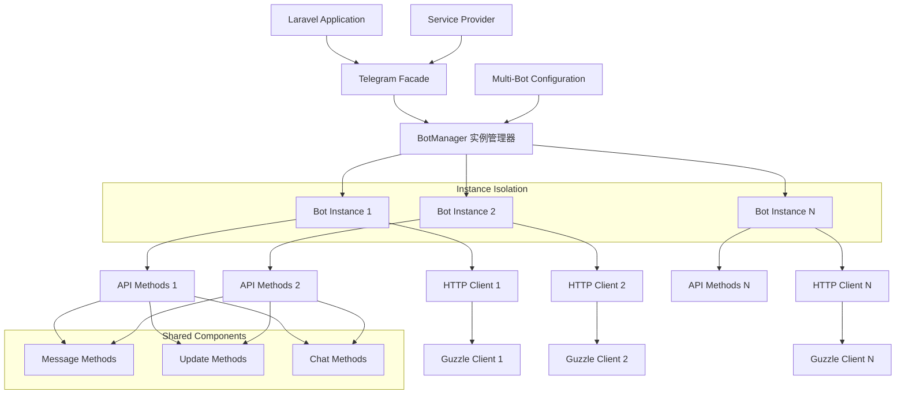

### 分层架构

| 层级      | 组件                   | 职责                    |
|---------|----------------------|-----------------------|
| **门面层** | Telegram Facade      | 提供静态访问接口，支持多实例路由      |
| **管理层** | BotManager           | 管理多个 Bot 实例，提供实例隔离    |
| **实例层** | TelegramBot Instance | 单个 Bot 实例，独立的认证和配置    |
| **方法层** | API Methods          | 封装具体的 Telegram API 方法 |
| **传输层** | HTTP Client          | 处理 HTTP 请求和响应，每实例独立   |
| **数据层** | DTO/Models           | 数据传输对象和模型定义           |

## 核心组件设计

### 1. BotManager 多实例管理器

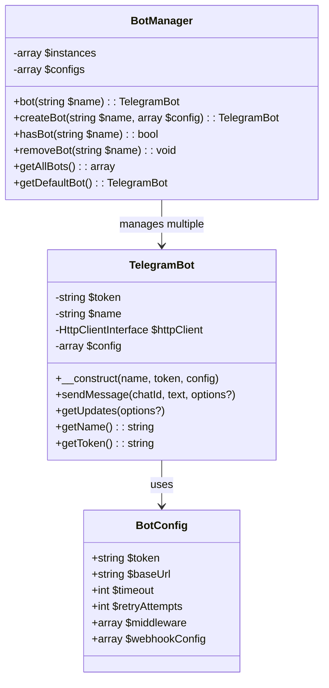

### 2. 实例隔离机制

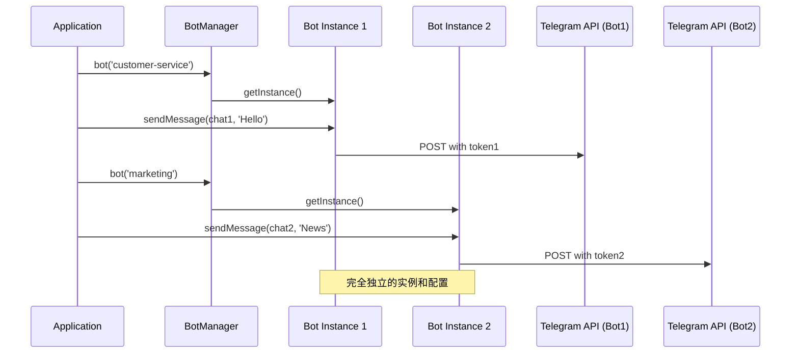

### 3. TelegramBot 客户端

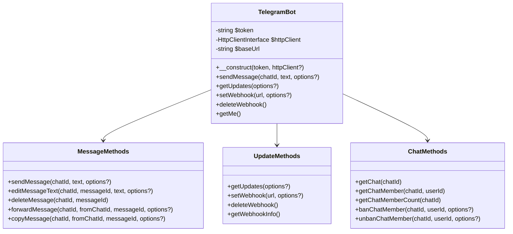

### 2. HTTP 客户端封装

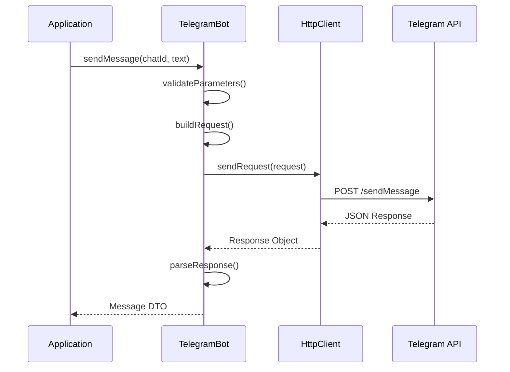

### 3. 响应处理机制

| 响应类型     | 处理方式                 | 返回值        |
|----------|----------------------|------------|
| **成功响应** | 解析 result 字段         | 对应的 DTO 对象 |
| **错误响应** | 抛出 TelegramException | -          |
| **网络错误** | 抛出 HttpException     | -          |
| **超时**   | 重试机制 + 异常            | -          |

### 4. 数据传输对象（DTO）

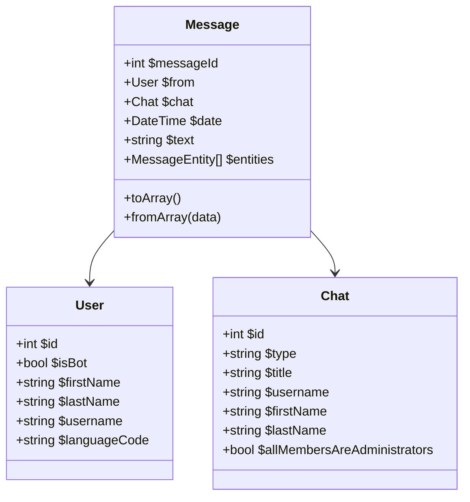

### 5. 实例生命周期管理

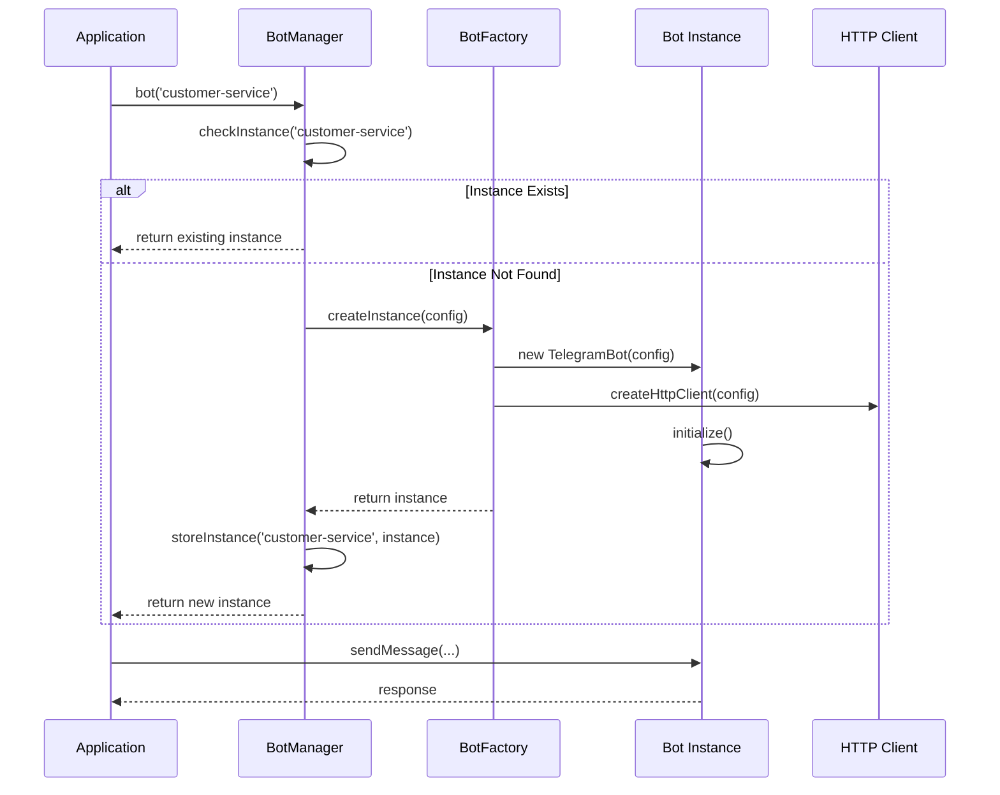

### 6. 资源隔离机制

| 资源类型         | 隔离策略         | 实现方式               |
|--------------|--------------|--------------------|
| **HTTP 连接**  | 每个 Bot 独立连接池 | Guzzle Client 实例化  |
| **认证 Token** | Bot 级别存储     | 实例属性封装             |
| **配置信息**     | 按名称空间分组      | 配置数组结构             |
| **事件监听**     | 带 Bot 标识的事件  | Event Namespace    |
| **缓存数据**     | 按 Bot 名称分组   | Cache Key Prefix   |
| **日志记录**     | 带 Bot 上下文    | Contextual Logging |

## API 方法组织

### 方法分类

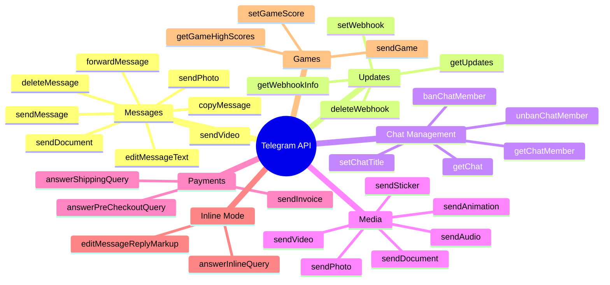

### 方法实现模式

| 方法类型     | 实现模式       | 示例                                   |
|----------|------------|--------------------------------------|
| **简单方法** | 直接 HTTP 调用 | `getMe()`, `deleteWebhook()`         |
| **参数丰富** | 构建器模式      | `sendMessage()`, `editMessageText()` |
| **文件上传** | 多部分表单      | `sendPhoto()`, `sendDocument()`      |
| **批量操作** | 数组参数       | `sendMediaGroup()`                   |

## Laravel 集成

### 多 Bot 服务提供者架构

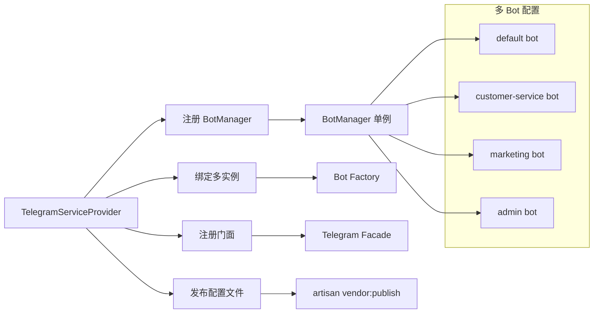

### 多 Bot 配置管理

| 配置项                          | 类型     | 说明          | 示例                             |
|------------------------------|--------|-------------|--------------------------------|
| `default`                    | string | 默认 Bot 名称   | `'main'`                       |
| `bots.{name}.token`          | string | Bot Token   | `env('TELEGRAM_BOT_TOKEN')`    |
| `bots.{name}.base_url`       | string | API 基础 URL  | `https://api.telegram.org/bot` |
| `bots.{name}.timeout`        | int    | 请求超时时间（秒）   | 30                             |
| `bots.{name}.retry_attempts` | int    | 重试次数        | 3                              |
| `bots.{name}.webhook_url`    | string | Webhook URL | `null`                         |
| `bots.{name}.middleware`     | array  | 中间件配置       | `[]`                           |

### 配置文件示例

```php
// config/telegram.php
return [
    'default' => 'main',
    
    'bots' => [
        'main' => [
            'token' => env('TELEGRAM_MAIN_BOT_TOKEN'),
            'base_url' => 'https://api.telegram.org/bot',
            'timeout' => 30,
            'retry_attempts' => 3,
            'webhook_url' => env('TELEGRAM_MAIN_WEBHOOK_URL'),
            'middleware' => ['auth', 'rate_limit'],
        ],
        
        'customer-service' => [
            'token' => env('TELEGRAM_CS_BOT_TOKEN'),
            'base_url' => 'https://api.telegram.org/bot',
            'timeout' => 15,
            'retry_attempts' => 2,
            'webhook_url' => env('TELEGRAM_CS_WEBHOOK_URL'),
            'middleware' => ['auth'],
        ],
        
        'marketing' => [
            'token' => env('TELEGRAM_MARKETING_BOT_TOKEN'),
            'base_url' => 'https://api.telegram.org/bot',
            'timeout' => 60,
            'retry_attempts' => 5,
            'middleware' => ['rate_limit'],
        ],
    ],
];
```

### 多实例门面使用模式

```php
// 使用默认 Bot
Telegram::sendMessage($chatId, 'Hello World!');

// 使用指定名称的 Bot
Telegram::bot('customer-service')->sendMessage($chatId, '客服回复');
Telegram::bot('marketing')->sendMessage($chatId, '营销消息');

// 链式调用
Telegram::bot('admin')
    ->to($chatId)
    ->message('管理员通知')
    ->keyboard($keyboard)
    ->send();

// 批量操作不同 Bot
$customerBot = Telegram::bot('customer-service');
$marketingBot = Telegram::bot('marketing');

$customerBot->sendMessage($chat1, '客服消息 1');
$marketingBot->sendMessage($chat2, '营销消息 1');
$customerBot->sendMessage($chat1, '客服消息 2');
$marketingBot->sendMessage($chat2, '营销消息 2');
```

## 错误处理策略

### 异常层次结构

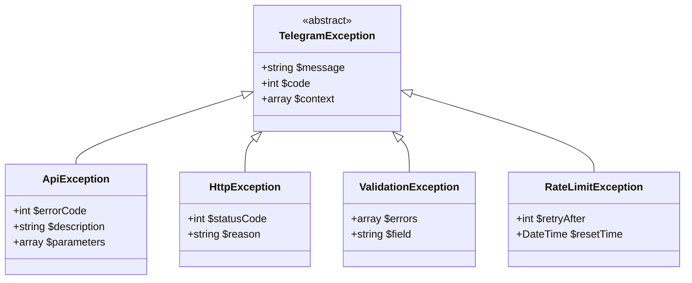

### 错误处理流程

| 错误类型       | HTTP 状态码 | 处理策略                   |
|------------|----------|------------------------|
| **参数错误**   | 400      | 抛出 ValidationException |
| **认证失败**   | 401      | 抛出 ApiException        |
| **权限不足**   | 403      | 抛出 ApiException        |
| **资源不存在**  | 404      | 抛出 ApiException        |
| **请求过于频繁** | 429      | 实现退避重试                 |
| **服务器错误**  | 5xx      | 重试机制                   |

## 高级特性

### 1. 多实例 Webhook 处理

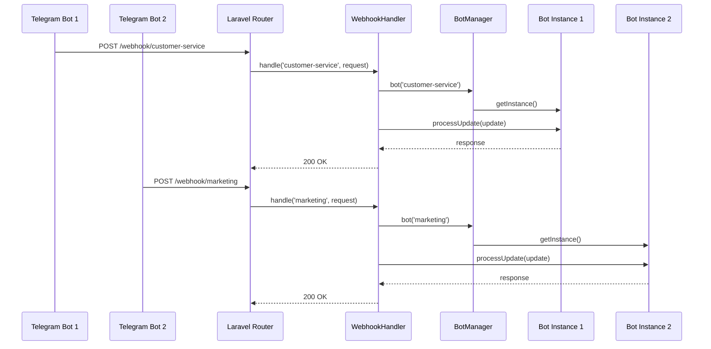

### 2. 实例隔离中间件系统

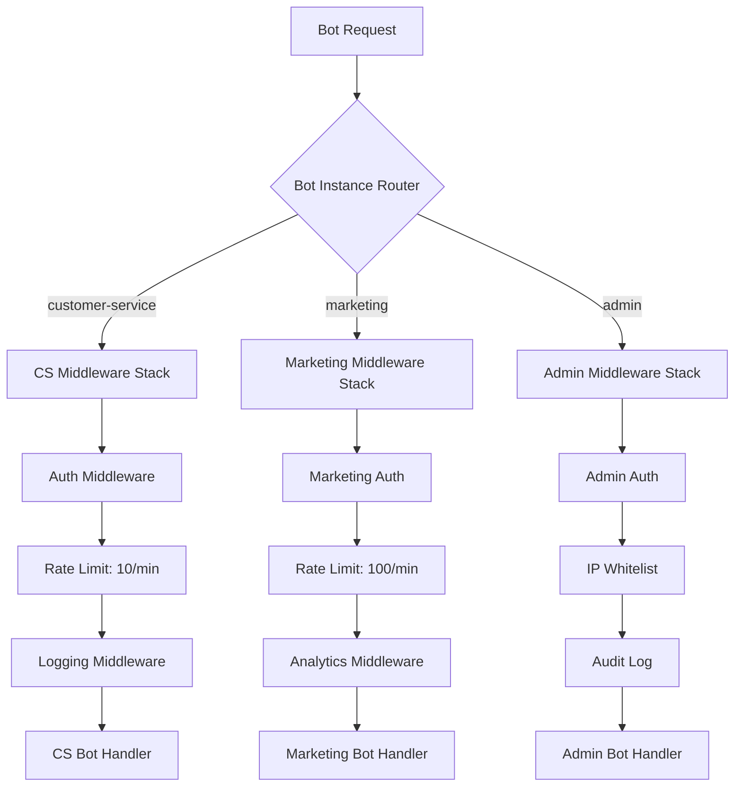

### 3. 多实例事件系统

| 事件类型                    | 命名规则                          | 携带数据                         |
|-------------------------|-------------------------------|------------------------------|
| `MessageReceived`       | `{botName}.message.received`  | Bot Name + Message DTO       |
| `CallbackQueryReceived` | `{botName}.callback.received` | Bot Name + CallbackQuery DTO |
| `InlineQueryReceived`   | `{botName}.inline.received`   | Bot Name + InlineQuery DTO   |
| `WebhookUpdated`        | `{botName}.webhook.updated`   | Bot Name + Webhook Config    |

### 4. 实例状态管理

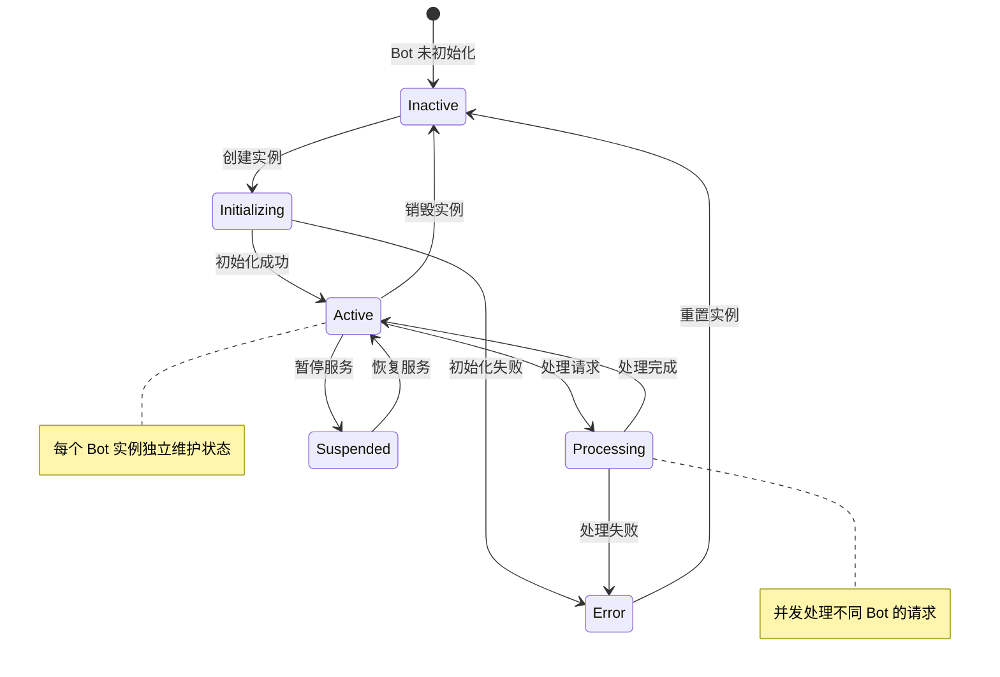

### 5. 性能优化机制

| 优化策略     | 实现方式               | 优势        |
|----------|--------------------|-----------|
| **实例复用** | 单例模式 + 懒加载         | 减少内存占用    |
| **连接池**  | 每个 Bot 独立 HTTP 连接池 | 提高并发性能    |
| **缓存策略** | 按 Bot 名称分组缓存       | 避免跨实例数据混淆 |
| **异步处理** | 支持 Promise/Future  | 提高处理效率    |

## 测试策略

### 多实例测试层次

```mermaid
pyramid
    title 多实例测试金字塔
    section Unit Tests
        BotManager 测试
        实例隔离测试
        API Methods
        DTO Classes
    section Integration Tests
        多 Bot HTTP 客户端
        Laravel 多实例集成
        Webhook 多路由
    section Feature Tests
        多 Bot 并发场景
        实例状态管理
        跨实例隔离性
```

### 测试工具配置

| 工具                      | 用途           | 多实例特性        |
|-------------------------|--------------|--------------|
| **PestPHP**             | 测试框架         | 支持并发测试多个 Bot |
| **Orchestra Testbench** | Laravel 测试环境 | 模拟多 Bot 配置   |
| **Mockery**             | Mock 对象      | 每个实例独立 Mock  |
| **PHPStan**             | 静态分析         | 检查类型安全和实例隔离  |

### 多实例 Mock 策略

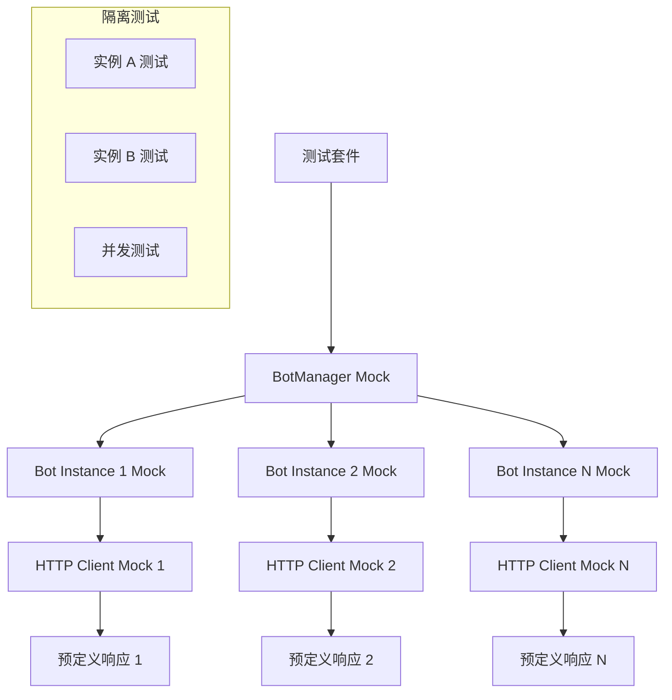

### 关键测试用例

| 测试类型           | 测试内容            | 验证目标         |
|----------------|-----------------|--------------|
| **实例隔离**       | 不同 Bot 同时发送消息   | 互不干扰，数据不混淆   |
| **配置独立**       | 各 Bot 使用不同配置    | 配置不会相互影响     |
| **并发处理**       | 多 Bot 并发 API 调用 | 性能和稳定性       |
| **错误隔离**       | 一个 Bot 错误不影响其他  | 容错性和稳定性      |
| **内存管理**       | 实例创建和销毁         | 内存泄漏检测       |
| **Webhook 路由** | 多个 Webhook 端点   | 请求路由到正确的 Bot |
