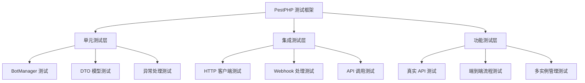
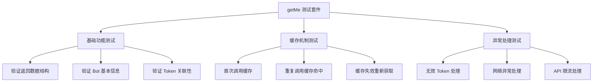
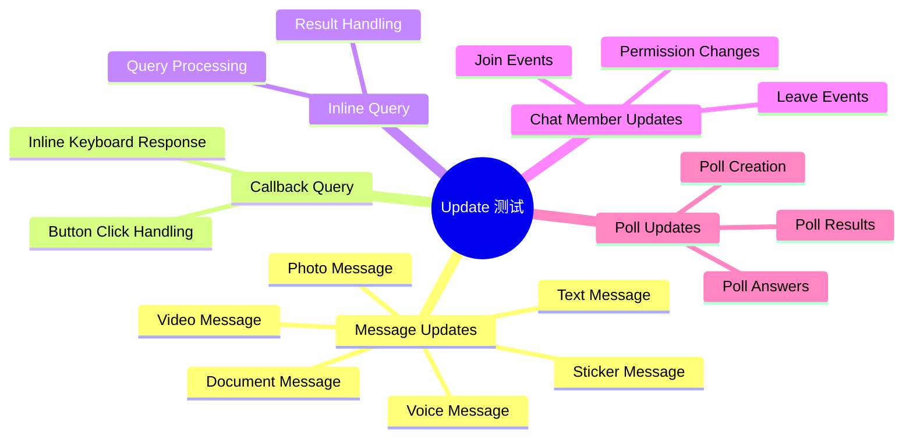
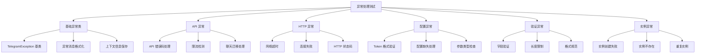
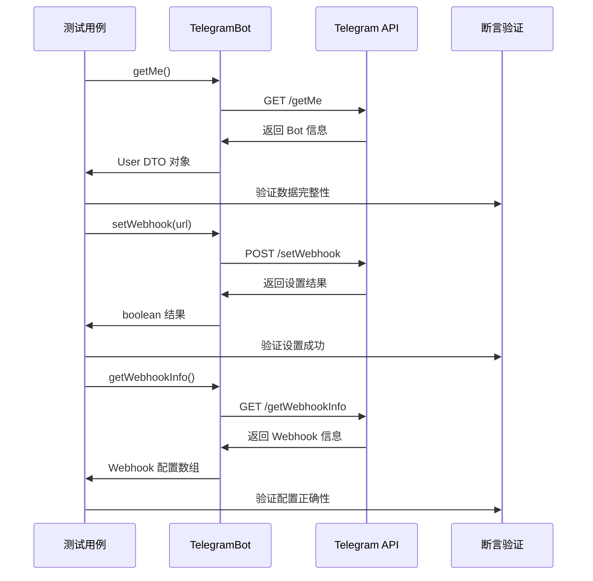
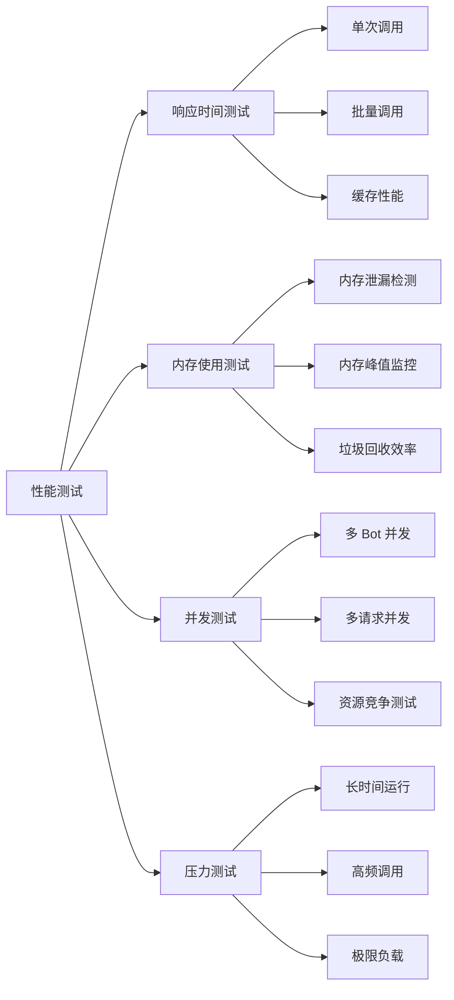
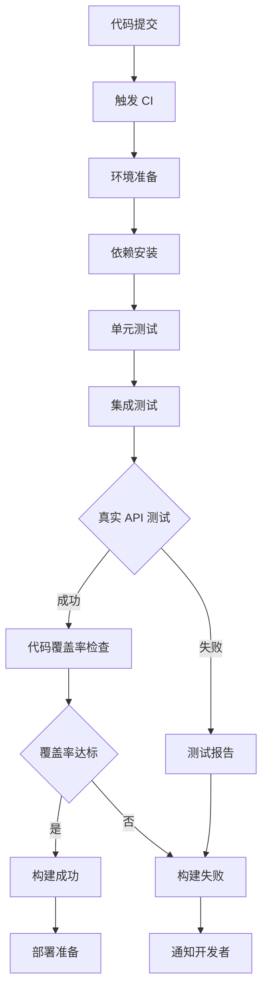

# Telegram SDK 单元测试设计

## 概述

本文档为 Telegram SDK 项目设计完整的单元测试方案，重点测试核心功能的完整性和可靠性。测试将从最基础的 `getMe`、`Webhook`、`Update` 功能开始，使用真实的 Telegram API 服务器进行测试，确保 SDK 在实际环境中的可用性。

### 测试策略

- **渐进式测试**：从简单功能开始，逐步扩展到复杂场景
- **真实环境测试**：使用真实 Token 连接 Telegram API 进行集成测试
- **多层次验证**：单元测试、集成测试、端到端测试结合
- **异常处理测试**：重点验证各种异常情况的处理机制

## 技术架构

### 测试框架



### 测试环境配置

| 配置项 | 值 | 说明 |
|--------|-----|------|
| 测试框架 | PestPHP | 基于 PHPUnit 的现代测试框架 |
| Laravel 支持 | Orchestra Testbench | 提供 Laravel 环境模拟 |
| 真实 Token | `7757335564:AAEiAxBmAo_a6NPziK8OVy243pAzRiCtHpE` | 用于真实 API 测试 |
| 测试 Bot 名称 | `real_bot` | 区分于模拟测试配置 |
| 基础 URL | `https://api.telegram.org/bot` | Telegram 官方 API 地址 |

## 核心功能测试

### getMe 功能测试

#### 测试目标
验证 Bot 信息获取功能的正确性，包括基本信息验证、缓存机制、错误处理等。

#### 测试用例设计



#### 测试实现规范

1. **数据结构验证**
   - 验证返回的 User DTO 对象完整性
   - 确认必填字段（id, is_bot, first_name）存在
   - 验证字段类型和格式正确性

2. **业务逻辑验证**
   - 确认返回的是当前 Bot 的信息
   - 验证 is_bot 字段为 true
   - 检查 Bot 名称和用户名格式

3. **缓存机制验证**
   - 首次调用时发起 HTTP 请求
   - 后续调用使用缓存数据
   - 验证缓存数据与原始数据一致性

### Webhook 功能测试

#### 测试目标
验证 Webhook 设置、获取、删除功能，以及安全验证机制的有效性。

#### 测试架构设计

```mermaid
graph TD
    A[Webhook 测试] --> B[设置测试]
    A --> C[信息获取测试]
    A --> D[删除测试]
    A --> E[安全验证测试]
    
    B --> B1[HTTPS URL 验证]
    B --> B2[参数完整性检查]
    B --> B3[证书上传测试]
    
    C --> C1[信息完整性验证]
    C --> C2[状态一致性检查]
    C --> C3[错误信息解析]
    
    D --> D1[普通删除]
    D --> D2[强制删除(丢弃更新)]
    D --> D3[删除后状态验证]
    
    E --> E1[签名验证机制]
    E --> E2[密钥配置测试]
    E --> E3[中间件集成测试]
```

#### 核心测试场景

1. **Webhook 设置功能**
   - 有效 HTTPS URL 设置
   - 无效 URL 格式处理
   - 可选参数配置（max_connections, allowed_updates）
   - 自签名证书上传

2. **Webhook 信息查询**
   - 获取当前 Webhook 配置
   - 解析挂起的更新数量
   - 错误状态信息解析

3. **Webhook 删除功能**
   - 标准删除流程
   - 丢弃挂起更新的删除
   - 删除后状态重置验证

### Update 处理测试

#### 测试目标
验证更新对象的创建、解析、验证功能，确保能正确处理各种类型的 Telegram 更新。

#### Update 类型覆盖



#### 测试实现策略

1. **DTO 对象验证**
   - Update 对象创建和字段映射
   - 嵌套对象（Message, User, Chat）正确解析
   - 可选字段处理和默认值设置

2. **类型识别验证**
   - 正确识别更新类型（消息、回调查询等）
   - getType() 方法返回正确类型
   - 类型特定的处理逻辑

3. **数据完整性验证**
   - 验证方法正确执行
   - 必填字段存在性检查
   - 数据格式和范围验证

## 异常处理体系测试

### 异常分层测试



### 异常场景测试用例

1. **API 异常测试**
   - 无效 Token 错误（401 Unauthorized）
   - API 限流错误（429 Too Many Requests）
   - 参数错误（400 Bad Request）
   - 聊天不存在错误（403 Forbidden）

2. **HTTP 异常测试**
   - 网络连接超时
   - DNS 解析失败
   - SSL 证书验证失败
   - 服务器内部错误（500）

3. **配置异常测试**
   - 缺失必要配置项
   - 无效的 Token 格式
   - 错误的 URL 配置
   - 不支持的参数类型

## 真实环境测试

### 测试配置

```php
// 真实环境测试配置
protected function defineRealEnvironment($app): void
{
    $app['config']->set('telegram.default', 'real_bot');
    
    $app['config']->set('telegram.bots.real_bot', [
        'token' => '7757335564:AAEiAxBmAo_a6NPziK8OVy243pAzRiCtHpE',
        'base_url' => 'https://api.telegram.org/bot',
        'timeout' => 30,
        'retry_attempts' => 3,
        'retry_delay' => 1000,
    ]);
}
```

### 真实 API 测试流程



### 测试执行策略

1. **环境隔离**
   - 真实测试使用独立配置
   - 模拟测试使用 Mock 数据
   - 测试环境标识明确

2. **API 调用限制**
   - 控制真实 API 调用频率
   - 实现测试间隔时间
   - 避免触发 API 限流

3. **数据清理**
   - 测试后清理 Webhook 设置
   - 恢复初始状态
   - 避免影响后续测试

## 测试实现规范

### 测试文件组织

```
tests/
├── Unit/
│   ├── GetMeTest.php              # getMe 功能单元测试
│   ├── WebhookTest.php            # Webhook 功能单元测试
│   ├── UpdateTest.php             # Update 处理单元测试
│   ├── ExceptionHandlingTest.php  # 异常处理测试
│   └── DTOTest.php                # DTO 模型测试
├── Integration/
│   ├── RealApiTest.php            # 真实 API 集成测试
│   ├── WebhookIntegrationTest.php # Webhook 集成测试
│   └── BotManagerIntegrationTest.php # Bot 管理器集成测试
└── Feature/
    ├── EndToEndTest.php           # 端到端测试
    └── MultiInstanceTest.php      # 多实例管理测试
```

### 测试命名规范

- **describe()**: 按功能模块分组
- **it()**: 具体测试用例描述
- **context()**: 特定条件下的测试场景
- **beforeEach()**: 每个测试前的准备工作

### 断言策略

```php
// 数据结构断言
expect($result)->toBeInstanceOf(User::class);
expect($result->id)->toBeInt();
expect($result->isBot)->toBeTrue();

// 异常断言
expect(fn() => $bot->getMe())->toThrow(ApiException::class);

// HTTP 调用断言
expect($httpClient)->toHaveReceived('post')->with('getMe', []);
```

### Mock 策略

1. **HTTP 客户端 Mock**
   - 模拟成功响应
   - 模拟各种错误场景
   - 验证请求参数正确性

2. **配置 Mock**
   - 模拟不同配置场景
   - 测试配置验证逻辑
   - 验证默认值处理

3. **外部依赖 Mock**
   - 网络请求模拟
   - 文件系统操作模拟
   - 时间函数模拟

## 性能测试

### 测试指标

| 指标 | 目标值 | 测试方法 |
|------|---------|----------|
| API 响应时间 | < 500ms | 真实 API 调用计时 |
| 内存使用 | < 10MB | 内存使用监控 |
| 并发处理能力 | 100 req/s | 并发测试 |
| 缓存命中率 | > 90% | 缓存统计 |

### 性能测试场景



## 持续集成

### CI/CD 流程



### 测试执行配置

1. **本地开发测试**
   - 快速单元测试执行
   - Mock 数据测试为主
   - 实时反馈机制

2. **集成环境测试**
   - 完整测试套件执行
   - 真实 API 测试包含
   - 性能测试验证

3. **生产环境验证**
   - 关键路径测试
   - 健康检查验证
   - 监控指标确认