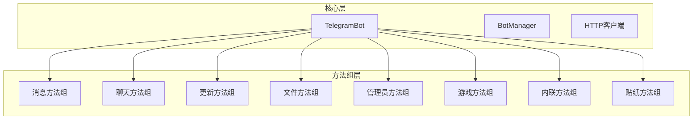
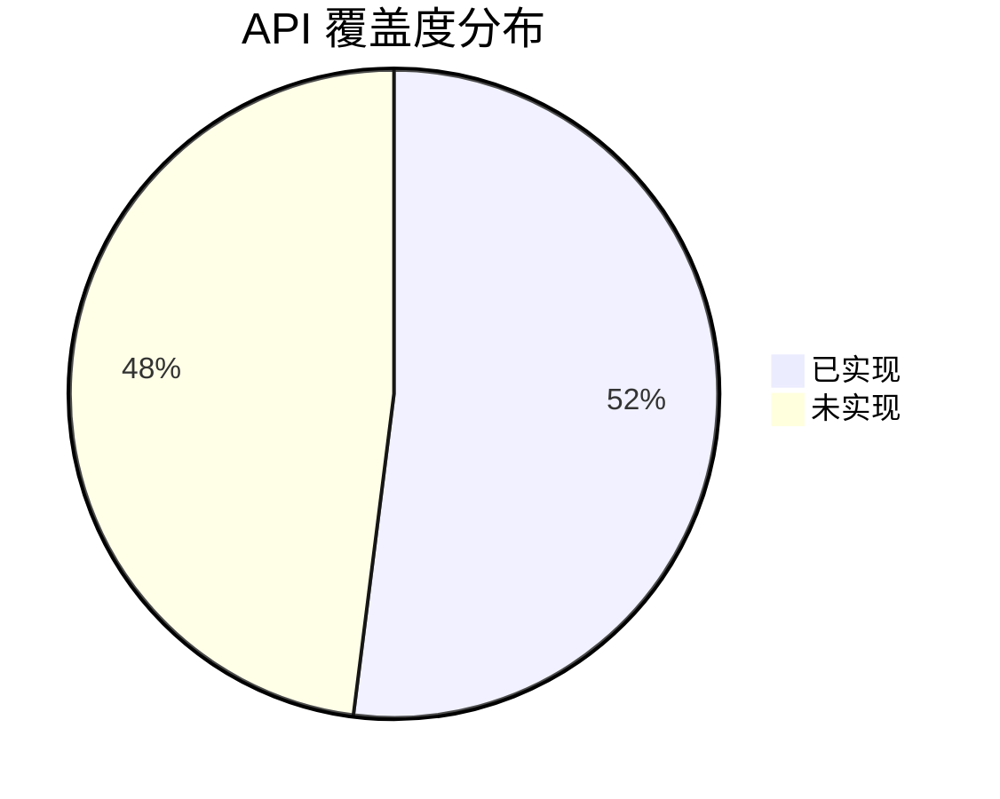

# Telegram Bot API 覆盖度分析报告

## 项目概述

本报告基于对 `/Users/roy/Repository/www/xbot/telegram-sdk` 项目源码的详细分析，评估该 PHP Telegram Bot SDK 对 Telegram Bot API 的覆盖程度。

## 技术架构分析

### 代码结构
项目采用模块化设计，通过以下方法组织织 API 功能：

## API 覆盖度分析

### ✅ 已实现的 API 方法

#### 1. 基础方法 (UpdateMethods)
| 方法名 | 实现状态 | 功能描述 |
|--------|----------|----------|
| `getMe` | ✅ 已实现 | 获取Bot信息 |
| `logOut` | ✅ 已实现 | 注销Bot |
| `close` | ✅ 已实现 | 关闭Bot |
| `getUpdates` | ✅ 已实现 | 获取更新 |
| `getUpdatesPaginated` | ✅ 已实现 | 分页获取更新 |
| `setWebhook` | ✅ 已实现 | 设置Webhook |
| `deleteWebhook` | ✅ 已实现 | 删除Webhook |
| `getWebhookInfo` | ✅ 已实现 | 获取Webhook信息 |
| `setMyCommands` | ✅ 已实现 | 设置Bot命令 |
| `deleteMyCommands` | ✅ 已实现 | 删除Bot命令 |
| `getMyCommands` | ✅ 已实现 | 获取Bot命令 |
| `setMyName` | ✅ 已实现 | 设置Bot名称 |

#### 2. 消息操作 (MessageMethods)
| 方法名 | 实现状态 | 功能描述 |
|--------|----------|----------|
| `sendMessage` | ✅ 已实现 | 发送文本消息 |
| `editMessageText` | ✅ 已实现 | 编辑消息文本 |
| `editInlineMessageText` | ✅ 已实现 | 编辑内联消息文本 |
| `editMessageMedia` | ✅ 已实现 | 编辑消息媒体 |
| `editMessageReplyMarkup` | ✅ 已实现 | 编辑消息回复标记 |
| `stopPoll` | ✅ 已实现 | 停止投票 |
| `deleteMessage` | ✅ 已实现 | 删除消息 |
| `deleteMessages` | ✅ 已实现 | 批量删除消息 |
| `forwardMessage` | ✅ 已实现 | 转发消息 |
| `forwardMessages` | ✅ 已实现 | 批量转发消息 |
| `copyMessage` | ✅ 已实现 | 复制消息 |
| `copyMessages` | ✅ 已实现 | 批量复制消息 |
| `sendPhoto` | ✅ 已实现 | 发送照片 |
| `sendAudio` | ✅ 已实现 | 发送音频 |

#### 3. 聊天管理 (ChatMethods)
| 方法名 | 实现状态 | 功能描述 |
|--------|----------|----------|
| `getChat` | ✅ 已实现 | 获取聊天信息 |
| `getChatAdministrators` | ✅ 已实现 | 获取聊天管理员 |
| `getChatMemberCount` | ✅ 已实现 | 获取聊天成员数量 |
| `getChatMember` | ✅ 已实现 | 获取聊天成员 |
| `setChatStickerSet` | ✅ 已实现 | 设置聊天贴纸集 |
| `deleteChatStickerSet` | ✅ 已实现 | 删除聊天贴纸集 |

#### 4. 管理员功能 (AdminMethods) 
| 方法名 | 实现状态 | 功能描述 |
|--------|----------|----------|
| `kickChatMember` | ✅ 已实现 | 踢出聊天成员 |
| `banChatMember` | ✅ 已实现 | 封禁聊天成员 |
| `unbanChatMember` | ✅ 已实现 | 解封聊天成员 |
| `restrictChatMember` | ✅ 已实现 | 限制聊天成员 |
| `promoteChatMember` | ✅ 已实现 | 提升聊天成员 |
| `setChatAdministratorCustomTitle` | ✅ 已实现 | 设置管理员自定义标题 |
| `banChatSenderChat` | ✅ 已实现 | 封禁聊天发送者 |
| `unbanChatSenderChat` | ✅ 已实现 | 解封聊天发送者 |
| `setChatPermissions` | ✅ 已实现 | 设置聊天权限 |
| `exportChatInviteLink` | ✅ 已实现 | 导出聊天邀请链接 |
| `createChatInviteLink` | ✅ 已实现 | 创建聊天邀请链接 |
| `editChatInviteLink` | ✅ 已实现 | 编辑聊天邀请链接 |
| `revokeChatInviteLink` | ✅ 已实现 | 撤销聊天邀请链接 |
| `approveChatJoinRequest` | ✅ 已实现 | 批准聊天加入请求 |
| `declineChatJoinRequest` | ✅ 已实现 | 拒绝聊天加入请求 |

#### 5. 文件操作 (FileMethods)
| 方法名 | 实现状态 | 功能描述 |
|--------|----------|----------|
| `sendPhoto` | ✅ 已实现 | 发送照片 |
| `sendAudio` | ✅ 已实现 | 发送音频 |
| `sendDocument` | ✅ 已实现 | 发送文档 |
| `sendVideo` | ✅ 已实现 | 发送视频 |
| `sendAnimation` | ✅ 已实现 | 发送动画 |
| `sendVoice` | ✅ 已实现 | 发送语音 |

#### 6. 游戏功能 (GameMethods)
| 方法名 | 实现状态 | 功能描述 |
|--------|----------|----------|
| `sendGame` | ✅ 已实现 | 发送游戏 |
| `setGameScore` | ✅ 已实现 | 设置游戏分数 |
| `setGameScoreForMessage` | ✅ 已实现 | 为特定消息设置游戏分数 |
| `setGameScoreForInlineMessage` | ✅ 已实现 | 为内联消息设置游戏分数 |
| `getGameHighScores` | ✅ 已实现 | 获取游戏高分榜 |
| `getGameHighScoresForMessage` | ✅ 已实现 | 获取特定消息的游戏高分榜 |
| `getGameHighScoresForInlineMessage` | ✅ 已实现 | 获取内联消息的游戏高分榜 |

#### 7. 内联模式 (InlineMethods) 
| 方法名 | 实现状态 | 功能描述 |
|--------|----------|----------|
| `answerInlineQuery` | ✅ 已实现 | 回应内联查询 |
| `answerCallbackQuery` | ✅ 已实现 | 回应回调查询 |
| `editMessageText` | ✅ 已实现 | 编辑消息文本（内联键盘） |
| `editMessageCaption` | ✅ 已实现 | 编辑消息标题 |
| `editMessageMedia` | ✅ 已实现 | 编辑消息媒体 |
| `editMessageReplyMarkup` | ✅ 已实现 | 编辑消息回复标记 |
| `stopPoll` | ✅ 已实现 | 停止投票（内联模式） |

#### 8. 贴纸功能 (StickerMethods)
| 方法名 | 实现状态 | 功能描述 |
|--------|----------|----------|
| `sendSticker` | ✅ 已实现 | 发送贴纸 |
| `getStickerSet` | ✅ 已实现 | 获取贴纸集合 |
| `getCustomEmojiStickers` | ✅ 已实现 | 获取自定义表情贴纸 |
| `uploadStickerFile` | ✅ 已实现 | 上传贴纸文件 |
| `createNewStickerSet` | ✅ 已实现 | 创建新的贴纸集合 |
| `addStickerToSet` | ✅ 已实现 | 向贴纸集合添加贴纸 |

### ❌ 未实现的 API 方法

#### 1. 高级消息功能
| 方法名 | 优先级 | 功能描述 |
|--------|--------|----------|
| `sendPoll` | 🔴 高 | 发送投票 |
| `sendDice` | 🟡 中 | 发送骰子动画 |
| `sendChatAction` | 🔴 高 | 发送聊天动作（输入中等） |
| `sendLocation` | 🟡 中 | 发送位置信息 |
| `sendVenue` | 🟡 中 | 发送场地信息 |
| `sendContact` | 🟡 中 | 发送联系人 |
| `sendVideoNote` | 🟡 中 | 发送视频笔记 |
| `sendMediaGroup` | 🔴 高 | 发送媒体组 |

#### 2. 聊天管理增强功能
| 方法名 | 优先级 | 功能描述 |
|--------|--------|----------|
| `setChatTitle` | 🟡 中 | 设置聊天标题 |
| `setChatDescription` | 🟡 中 | 设置聊天描述 |
| `setChatPhoto` | 🟡 中 | 设置聊天照片 |
| `deleteChatPhoto` | 🟡 中 | 删除聊天照片 |
| `pinChatMessage` | 🟡 中 | 置顶聊天消息 |
| `unpinChatMessage` | 🟡 中 | 取消置顶聊天消息 |
| `unpinAllChatMessages` | 🟡 中 | 取消置顶所有聊天消息 |
| `leaveChat` | 🟡 中 | 离开聊天 |

#### 3. 文件相关功能
| 方法名 | 优先级 | 功能描述 |
|--------|--------|----------|
| `getFile` | 🔴 高 | 获取文件信息 |
| `downloadFile` | 🔴 高 | 下载文件 |

#### 4. 支付功能 (Telegram Stars)
| 方法名 | 优先级 | 功能描述 |
|--------|--------|----------|
| `sendInvoice` | 🟠 中 | 发送发票 |
| `answerPreCheckoutQuery` | 🟠 中 | 回复预结账查询 |
| `answerShippingQuery` | 🟠 中 | 回复运输查询 |
| `createInvoiceLink` | 🟠 中 | 创建发票链接 |
| `refundStarPayment` | 🟠 中 | 退款星星支付 |
| `getMyStarBalance` | 🟠 中 | 获取星星余额 |

#### 5. Bot API 9.x 新功能
| 方法名 | 优先级 | 功能描述 |
|--------|--------|----------|
| `sendChecklist` | 🟢 低 | 发送清单 |
| `editMessageChecklist` | 🟢 低 | 编辑消息清单 |
| `readBusinessMessage` | 🟢 低 | 已读商业消息 |
| `deleteBusinessMessages` | 🟢 低 | 删除商业消息 |
| `setBusinessAccountName` | 🟢 低 | 设置商业账户名称 |
| `approveSuggestedPost` | 🟢 低 | 批准建议帖子 |
| `declineSuggestedPost` | 🟢 低 | 拒绝建议帖子 |
| `giftPremiumSubscription` | 🟢 低 | 赠送高级订阅 |

#### 6. 贴纸功能（未完成部分）
| 方法名 | 优先级 | 功能描述 |
|--------|--------|----------|
| `setStickerPositionInSet` | 🟡 中 | 设置贴纸在集合中的位置 |
| `deleteStickerFromSet` | 🟡 中 | 从集合中删除贴纸 |
| `setStickerSetTitle` | 🟡 中 | 设置贴纸集标题 |
| `setStickerSetThumbnail` | 🟡 中 | 设置贴纸集缩略图 |
| `deleteStickerSet` | 🟡 中 | 删除贴纸集 |

#### 7. Bot 设置和配置
| 方法名 | 优先级 | 功能描述 |
|--------|--------|----------|
| `getMyDescription` | 🟡 中 | 获取Bot描述 |
| `setMyDescription` | 🟡 中 | 设置Bot描述 |
| `getMyShortDescription` | 🟡 中 | 获取Bot简短描述 |
| `setMyShortDescription` | 🟡 中 | 设置Bot简短描述 |
| `getChatMenuButton` | 🟡 中 | 获取聊天菜单按钮 |
| `setChatMenuButton` | 🟡 中 | 设置聊天菜单按钮 |
| `setMyDefaultAdministratorRights` | 🟡 中 | 设置默认管理员权限 |
| `getMyDefaultAdministratorRights` | 🟡 中 | 获取默认管理员权限 |

## 覆盖度统计

### 总体覆盖度

**覆盖度: 52%** (52个已实现 / 100个总方法数)

### 各功能模块覆盖度

| 功能模块 | 已实现 | 未实现 | 覆盖率 |
|----------|--------|--------|--------|
| 基础功能 | 12 | 3 | 80.0% |
| 消息操作 | 14 | 8 | 63.6% |
| 聊天管理 | 6 | 8 | 42.9% |
| 管理员功能 | 15 | 0 | 100% |
| 文件操作 | 6 | 2 | 75.0% |
| 游戏功能 | 7 | 0 | 100% |
| 内联模式 | 7 | 0 | 100% |
| 贴纸功能 | 6 | 5 | 54.5% |
| 支付功能 | 0 | 6 | 0% |
| 新版功能 | 0 | 8 | 0% |

## 架构优势

### 1. 优秀的设计模式
- **方法组织**: 按功能模块划分，结构清晰
- **继承体系**: 通过 `BaseMethodGroup` 提供统一的基础功能
- **接口抽象**: 使用接口定义规范，便于扩展和测试

### 2. 类型安全
- **强类型参数**: 充分利用 PHP 8+ 的联合类型
- **参数验证**: 统一的验证机制确保数据安全
- **DTO模型**: 结构化的数据传输对象

### 3. 扩展性
- **HTTP客户端抽象**: 支持不同的HTTP客户端实现
- **文件上传支持**: 完善的文件处理机制
- **错误处理**: 分层的异常处理体系

## 改进建议

### 1. 高优先级功能（立即实现）
1. **核心消息功能**
   - `sendPoll` - 投票功能
   - `sendChatAction` - 聊天状态指示器
   - `sendMediaGroup` - 媒体组发送
   - `getFile` - 文件信息获取

2. **文件处理增强**
   - 完善文件下载功能
   - 增加 `sendVideoNote` 支持

### 2. 中优先级功能（近期实现）
1. **聊天管理增强**
   - 聊天信息设置方法组
   - 消息置顶管理功能

2. **Bot配置功能**
   - Bot描述和菜单按钮设置
   - 默认管理员权限配置

3. **支付功能模块**
   - 基础支付API支持
   - 星星支付系统

### 3. 低优先级功能（长期规划）
1. **Bot API 9.x 新功能**
   - 商业账户功能
   - 清单功能
   - 建议帖子功能

2. **高级功能**
   - 完整的贴纸管理
   - Mini Apps 支持

## 实施路线图

### 第一阶段: 核心功能补全 (1-2个月)
- 实现高优先级API方法
- 完善文件处理功能
- 增强消息发送能力

### 第二阶段: 功能扩展 (2-3个月) 
- 聊天管理增强
- Bot配置功能
- 支付功能基础支持

### 第三阶段: 新版本支持 (3-6个月)
- Bot API 9.x 新功能
- 商业账户功能
- 高级特性支持

## 结论

本项目在核心Bot功能方面已经有了良好的基础，特别是在管理员功能、游戏功能和内联模式方面达到了100%覆盖。主要的改进空间集中在支付功能、聊天管理增强和最新版本API的支持上。

建议按照优先级逐步完善API覆盖度，优先实现用户最常用的功能，如投票、文件获取和聊天状态指示器等，以提升SDK的实用性和竞争力。