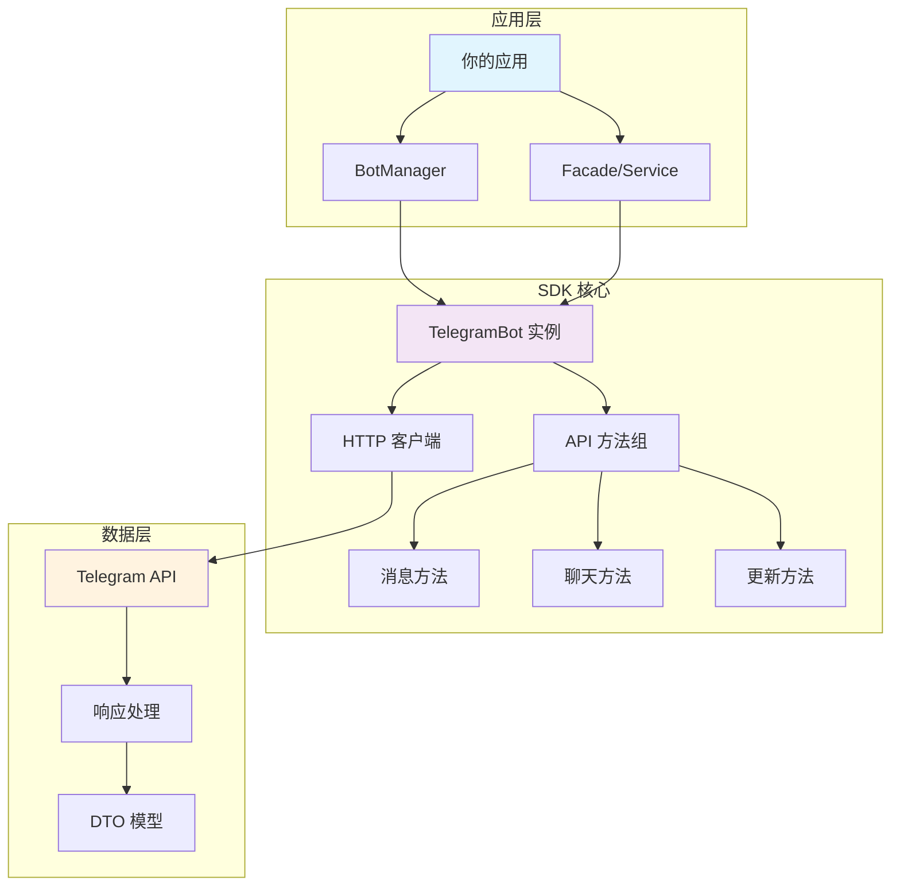

# Telegram Bot PHP SDK

> 🤖 一个功能强大、易于使用的 PHP Telegram Bot API 封装库，专为现代 PHP 开发者设计。

[](https://packagist.org/packages/xbot-my/telegram-sdk)
[](https://packagist.org/packages/xbot-my/telegram-sdk)
[](https://packagist.org/packages/xbot-my/telegram-sdk)
[](https://github.com/xbot-my/telegram-sdk/blob/main/LICENSE)

## ✨ 主要特性

- 🤖 **多 Bot 支持** - 在同一应用中管理多个独立的 Bot 实例
- 🛡️ **类型安全** - 基于 PHP 8.3+ 严格类型，提供完整的类型提示
- 🔒 **实例隔离** - 每个 Bot 实例完全独立，配置互不影响
- ⚡ **高性能** - 优化的 HTTP 客户端和智能缓存机制
- 🔄 **智能重试** - 内置重试策略，确保 API 调用的可靠性
- 📊 **统计监控** - 详细的调用统计和性能监控
- 🏗️ **Laravel 集成** - 深度集成 Laravel 框架，开箱即用
- 📖 **丰富文档** - 完整的 API 文档和实用示例

## 🚀 快速开始

### 1. 安装

```bash
composer require xbot-my/telegram-sdk
```

### 2. 基础使用

```php
<?php

use XBot\Telegram\BotManager;
use XBot\Telegram\Http\GuzzleHttpClient;

// 创建 HTTP 客户端
$httpClient = new GuzzleHttpClient('YOUR_BOT_TOKEN');

// 创建 Bot 管理器
$manager = new BotManager();

// 创建 Bot 实例
$bot = $manager->createBot('main', $httpClient);

// 发送消息
$message = $bot->sendMessage(
    chatId: 123456789,
    text: '你好，世界！'
);

echo "消息已发送，ID: " . $message->messageId;
```

### 3. Laravel 使用

```php
<?php

use XBot\Telegram\Facades\Telegram;

// 使用门面发送消息
$message = Telegram::sendMessage(123456789, '欢迎使用 Laravel！');

// 使用指定 Bot
$message = Telegram::bot('customer-service')->sendMessage(
    chatId: 123456789,
    text: '客服为您服务'
);
```

## 📖 文档导航

### 🎯 新手入门
- [📦 安装指南](guide/installation.md) - 详细的安装和环境配置
- [🚀 快速开始](guide/quick-start.md) - 5 分钟上手指南
- [⚙️ 配置说明](guide/configuration.md) - 完整的配置选项说明

### 📚 深入学习
- [📋 API 参考](api/) - 完整的 API 文档
- [💡 使用示例](examples/) - 实用的代码示例
- [⭐ 最佳实践](best-practices/) - 专业开发建议

### 🔧 问题解决
- [❓ 常见问题](troubleshooting/common-issues.md) - 解决常见问题
- [🐛 调试指南](troubleshooting/debugging.md) - 调试技巧和工具

## 🏗️ 架构概览



## 🌟 核心组件

| 组件 | 描述 | 主要功能 |
|------|------|----------|
| **BotManager** | Bot 实例管理器 | 创建、管理和缓存 Bot 实例 |
| **TelegramBot** | 单个 Bot 实例 | 封装所有 Telegram API 方法 |
| **HttpClient** | HTTP 通信客户端 | 处理与 Telegram 服务器的通信 |
| **DTO Models** | 数据传输对象 | 类型安全的数据模型 |
| **Method Groups** | API 方法组 | 按功能分组的 API 方法 |

## 💻 代码示例

### 发送不同类型的消息

```php
// 发送文本消息
$bot->sendMessage(123456789, '这是一条文本消息');

// 发送带格式的消息
$bot->sendMessage(123456789, '<b>粗体</b> 和 <i>斜体</i>', [
    'parse_mode' => 'HTML'
]);

// 发送带键盘的消息
$bot->sendMessage(123456789, '请选择:', [
    'reply_markup' => [
        'inline_keyboard' => [
            [['text' => '选项 1', 'callback_data' => 'option_1']],
            [['text' => '选项 2', 'callback_data' => 'option_2']]
        ]
    ]
]);
```

### 处理 Webhook 更新

```php
use XBot\Telegram\Models\DTO\Update;

// 解析 Webhook 数据
$update = Update::fromArray($webhookData);

if ($update->isMessage()) {
    $message = $update->message;
    $chatId = $message->chat->id;
    $text = $message->text;
    
    // 回复消息
    $bot->sendMessage($chatId, "你说了: $text");
}
```

## 🤝 贡献

我们欢迎所有形式的贡献！请查看我们的 [贡献指南](https://github.com/xbot-my/telegram-sdk/blob/main/CONTRIBUTING.md)。

## 📄 许可证

该项目基于 [MIT 许可证](https://github.com/xbot-my/telegram-sdk/blob/main/LICENSE) 开源。

## 🔗 相关链接

- [Telegram Bot API 官方文档](https://core.telegram.org/bots/api)
- [项目 GitHub 仓库](https://github.com/xbot-my/telegram-sdk)
- [问题反馈](https://github.com/xbot-my/telegram-sdk/issues)
- [功能请求](https://github.com/xbot-my/telegram-sdk/discussions)

---

<div style="text-align: center; color: #666; margin-top: 2rem;">
  <p>🚀 开始您的 Telegram Bot 开发之旅吧！</p>
</div>