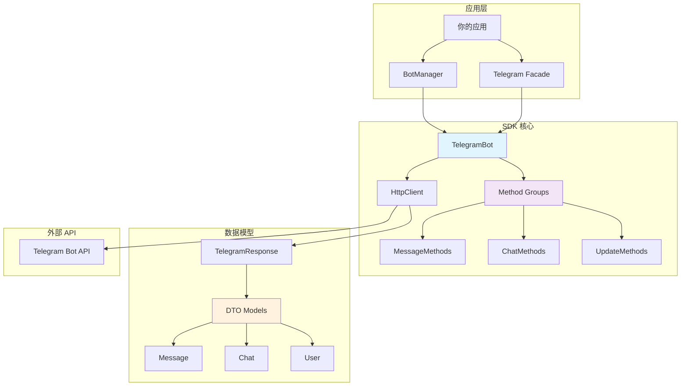

# 📋 API 参考

欢迎查阅 Telegram Bot PHP SDK 的完整 API 参考文档。本文档详细介绍了所有可用的类、方法和数据模型。

## 🏗️ 架构概览



## 📚 文档结构

### 🤖 核心类

| 类名 | 描述 | 文档链接 |
|------|------|----------|
| **BotManager** | Bot 实例管理器 | [查看文档](bot-manager.md) |
| **TelegramBot** | 单个 Bot 实例 | [查看文档](telegram-bot.md) |

### 🔧 API 方法组

| 方法组 | 功能范围 | 文档链接 |
|--------|----------|----------|
| **MessageMethods** | 消息相关操作 | [查看文档](methods/message.md) |
| **ChatMethods** | 聊天管理操作 | [查看文档](methods/chat.md) |
| **UpdateMethods** | 更新和 Webhook | [查看文档](methods/update.md) |

### 📦 数据模型

| 模型 | 用途 | 文档链接 |
|------|------|----------|
| **Message** | 消息数据结构 | [查看文档](models/message.md) |
| **Chat** | 聊天数据结构 | [查看文档](models/chat.md) |
| **User** | 用户数据结构 | [查看文档](models/user.md) |

## 🚀 快速导航

### 按使用频率

#### 🔥 最常用 API

```php
// 1. 发送消息
$bot->sendMessage($chatId, $text, $options);

// 2. 获取 Bot 信息
$botInfo = $bot->getMe();

// 3. 获取更新
$updates = $bot->getUpdates($options);

// 4. 设置 Webhook
$bot->setWebhook($url, $options);

// 5. 编辑消息
$bot->editMessageText($chatId, $messageId, $newText, $options);
```

#### ⚡ 常用 API

```php
// 删除消息
$bot->deleteMessage($chatId, $messageId);

// 发送图片
$bot->sendPhoto($chatId, $photo, $options);

// 发送文档
$bot->sendDocument($chatId, $document, $options);

// 获取聊天信息
$chat = $bot->getChat($chatId);

// 获取聊天成员
$member = $bot->getChatMember($chatId, $userId);
```

### 按功能分类

#### 📝 消息操作

| 方法 | 功能 | 示例 |
|------|------|------|
| `sendMessage` | 发送文本消息 | [📖](methods/message.md#sendmessage) |
| `sendPhoto` | 发送图片 | [📖](methods/message.md#sendphoto) |
| `sendDocument` | 发送文档 | [📖](methods/message.md#senddocument) |
| `editMessageText` | 编辑消息文本 | [📖](methods/message.md#editmessagetext) |
| `deleteMessage` | 删除消息 | [📖](methods/message.md#deletemessage) |

#### 👥 聊天管理

| 方法 | 功能 | 示例 |
|------|------|------|
| `getChat` | 获取聊天信息 | [📖](methods/chat.md#getchat) |
| `getChatMember` | 获取成员信息 | [📖](methods/chat.md#getchatmember) |
| `banChatMember` | 封禁成员 | [📖](methods/chat.md#banchatmember) |
| `promoteChatMember` | 提升管理员 | [📖](methods/chat.md#promotechatmember) |

#### 🔄 更新处理

| 方法 | 功能 | 示例 |
|------|------|------|
| `getUpdates` | 获取更新 | [📖](methods/update.md#getupdates) |
| `setWebhook` | 设置 Webhook | [📖](methods/update.md#setwebhook) |
| `getWebhookInfo` | 获取 Webhook 信息 | [📖](methods/update.md#getwebhookinfo) |

## 🏷️ 数据类型

### 基础类型

| 类型 | PHP 类型 | 说明 | 示例 |
|------|----------|------|------|
| **Integer** | `int` | 整数 | `123456789` |
| **String** | `string` | 字符串 | `"Hello, World!"` |
| **Boolean** | `bool` | 布尔值 | `true` / `false` |
| **Float** | `float` | 浮点数 | `3.14` |

### 复合类型

| 类型 | PHP 类型 | 说明 | 示例 |
|------|----------|------|------|
| **Array** | `array` | 数组 | `[1, 2, 3]` |
| **Object** | `object` | 对象 | `new Message()` |
| **Mixed** | `mixed` | 混合类型 | `string\|int` |
| **Nullable** | `?Type` | 可空类型 | `?string` |

### Telegram 特殊类型

| 类型 | 格式 | 说明 | 示例 |
|------|------|------|------|
| **ChatId** | `int\|string` | 聊天 ID | `123456789` 或 `"@username"` |
| **UserId** | `int` | 用户 ID | `987654321` |
| **MessageId** | `int` | 消息 ID | `42` |
| **InlineKeyboard** | `array` | 内联键盘 | `[['text' => 'Button', 'callback_data' => 'data']]` |

## 🔍 搜索 API

### 按方法名搜索

使用页面顶部的搜索框，输入方法名即可快速定位：

- 输入 `sendMessage` 查找发送消息相关文档
- 输入 `getUpdates` 查找获取更新相关文档
- 输入 `setWebhook` 查找 Webhook 设置文档

### 按功能搜索

常用搜索关键词：

| 关键词 | 相关功能 |
|--------|----------|
| `message` | 消息相关操作 |
| `chat` | 聊天相关操作 |
| `user` | 用户相关操作 |
| `webhook` | Webhook 相关操作 |
| `keyboard` | 键盘相关操作 |
| `file` | 文件相关操作 |

## 📖 使用说明

### 方法签名解读

```php
public function sendMessage(
    int|string $chatId,        // 必需参数：聊天ID
    string $text,              // 必需参数：消息文本
    array $options = []        // 可选参数：其他选项
): Message                     // 返回值：Message 对象
```

#### 参数说明

- **必需参数**: 调用方法时必须提供
- **可选参数**: 有默认值，可以不提供
- **类型提示**: `int|string` 表示接受整数或字符串
- **返回值**: 方法执行后返回的数据类型

### 选项参数格式

大多数方法都支持 `$options` 参数，用于传递额外的配置：

```php
$options = [
    'parse_mode' => 'HTML',           // 解析模式
    'disable_notification' => true,   // 静默发送
    'reply_to_message_id' => 123,    // 回复消息ID
    'reply_markup' => [              // 回复标记
        'inline_keyboard' => [...]
    ]
];

$bot->sendMessage($chatId, $text, $options);
```

### 错误处理

所有 API 方法都可能抛出异常：

```php
use XBot\Telegram\Exceptions\ApiException;
use XBot\Telegram\Exceptions\HttpException;

try {
    $message = $bot->sendMessage($chatId, $text);
} catch (ApiException $e) {
    // Telegram API 错误
    echo "API 错误: " . $e->getDescription();
    echo "错误代码: " . $e->getErrorCode();
} catch (HttpException $e) {
    // 网络错误
    echo "网络错误: " . $e->getMessage();
}
```

## 🔗 相关资源

### 官方文档

- [Telegram Bot API](https://core.telegram.org/bots/api) - 官方 API 文档
- [Bot 开发指南](https://core.telegram.org/bots) - 官方开发指南

### SDK 资源

- [GitHub 仓库](https://github.com/xbot-my/telegram-sdk) - 源码和 Issues
- [使用示例](../examples/) - 实用代码示例
- [最佳实践](../best-practices/) - 开发建议

### 开发工具

- [BotFather](https://t.me/botfather) - Bot 创建和管理
- [Telegram 测试服务器](https://core.telegram.org/bots/webapps#using-bots-in-the-test-environment) - 测试环境

## 💡 使用技巧

### 1. 链式调用

SDK 支持方法链式调用：

```php
$response = $bot
    ->sendMessage($chatId, '第一条消息')
    ->sendMessage($chatId, '第二条消息');
```

### 2. 批量操作

处理多个操作时，使用循环：

```php
$chatIds = [123456789, 987654321];
foreach ($chatIds as $chatId) {
    $bot->sendMessage($chatId, '广播消息');
}
```

### 3. 条件参数

根据条件动态构建参数：

```php
$options = [];
if ($shouldNotify) {
    $options['disable_notification'] = false;
}
if ($replyToMessage) {
    $options['reply_to_message_id'] = $replyToMessage;
}

$bot->sendMessage($chatId, $text, $options);
```

---

🔍 **开始探索 API**: 选择左侧导航中的具体类或方法，查看详细文档。