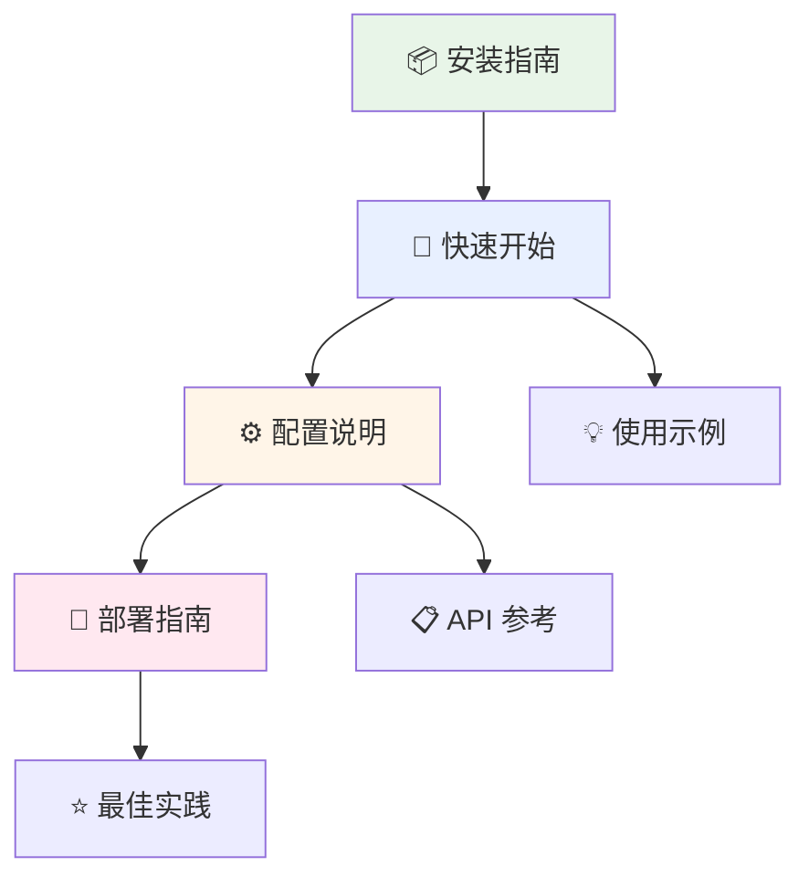

# 📘 用户指南

欢迎来到 Telegram Bot PHP SDK 用户指南！本指南将帮助您从零开始，逐步掌握 SDK 的使用。

## 🎯 学习路径

## 📚 指南内容

### 🏁 入门指南

| 章节 | 内容概要 | 预计时间 | 难度 |
|------|----------|----------|------|
| [📦 安装指南](installation.md) | 环境准备、SDK 安装、Laravel 集成 | 15 分钟 | ⭐ |
| [🚀 快速开始](quick-start.md) | 5 分钟创建第一个 Bot | 10 分钟 | ⭐ |

### 🔧 配置和部署

| 章节 | 内容概要 | 预计时间 | 难度 |
|------|----------|----------|------|
| [⚙️ 配置说明](configuration.md) | 详细配置选项、最佳实践 | 30 分钟 | ⭐⭐ |
| [🚢 部署指南](deployment.md) | 生产环境部署、容器化、云部署 | 45 分钟 | ⭐⭐⭐ |

## 🎯 不同角色的学习建议

### 👨‍💻 新手开发者

**推荐学习顺序**:
1. 📦 [安装指南](installation.md) - 了解环境要求
2. 🚀 [快速开始](quick-start.md) - 创建第一个 Bot
3. 💡 [基础使用示例](../examples/basic-usage.md) - 学习常用功能
4. ❓ [常见问题](../troubleshooting/common-issues.md) - 解决常见问题

**预计学习时间**: 2-3 小时

### 🏗️ 架构师/Tech Lead

**推荐学习顺序**:
1. ⚙️ [配置说明](configuration.md) - 深入了解配置选项
2. 📋 [API 参考](../api/) - 掌握完整 API
3. 🚢 [部署指南](deployment.md) - 生产环境部署
4. ⭐ [最佳实践](../best-practices/) - 企业级开发规范

**预计学习时间**: 4-6 小时

### 🚀 DevOps 工程师

**推荐学习顺序**:
1. 🚢 [部署指南](deployment.md) - 重点关注容器化和云部署
2. 🔧 [故障排除](../troubleshooting/) - 运维问题解决
3. ⚡ [性能优化](../best-practices/performance.md) - 性能调优
4. 🔒 [安全实践](../best-practices/security.md) - 安全配置

**预计学习时间**: 3-4 小时

## 🛠️ 实践项目

### 初级项目：回声 Bot

创建一个简单的回声 Bot，用户发送什么，Bot 就回复什么。

**学习目标**:
- ✅ 掌握基础消息发送
- ✅ 理解 Webhook 处理
- ✅ 学会错误处理

**涉及章节**:
- [快速开始](quick-start.md)
- [基础使用](../examples/basic-usage.md)

### 中级项目：客服 Bot

创建一个客服 Bot，支持多轮对话、菜单导航、FAQ 查询。

**学习目标**:
- ✅ 掌握高级消息类型
- ✅ 实现状态管理
- ✅ 集成数据库

**涉及章节**:
- [配置说明](configuration.md)
- [Laravel 集成](../examples/laravel-integration.md)
- [高级特性](../examples/advanced-features.md)

### 高级项目：企业级通知系统

创建一个企业级的 Telegram 通知系统，支持多 Bot、权限管理、统计分析。

**学习目标**:
- ✅ 多 Bot 架构设计
- ✅ 生产环境部署
- ✅ 监控和维护

**涉及章节**:
- [部署指南](deployment.md)
- [最佳实践](../best-practices/)
- [性能优化](../best-practices/performance.md)

## 🔍 快速查找

### 按功能查找

| 功能 | 相关章节 | 页面 |
|------|----------|------|
| 发送消息 | [快速开始](quick-start.md) | 第 4 步 |
| 处理 Webhook | [快速开始](quick-start.md) | 第 9 步 |
| 多 Bot 管理 | [配置说明](configuration.md) | Laravel 配置 |
| SSL 配置 | [部署指南](deployment.md) | SSL/HTTPS 配置 |
| 性能优化 | [部署指南](deployment.md) | 性能优化 |
| 错误处理 | [快速开始](quick-start.md) | 实用技巧 |

### 按问题查找

| 问题类型 | 解决方案 | 页面 |
|----------|----------|------|
| 安装失败 | [安装指南](installation.md) | 常见安装问题 |
| 连接超时 | [配置说明](configuration.md) | HTTP 客户端配置 |
| 权限错误 | [部署指南](deployment.md) | 故障排除 |
| 性能问题 | [部署指南](deployment.md) | 性能优化 |

## 📖 学习资源

### 官方文档

- [Telegram Bot API](https://core.telegram.org/bots/api) - 官方 API 文档
- [BotFather](https://core.telegram.org/bots#6-botfather) - Bot 创建和管理

### 社区资源

- [GitHub 仓库](https://github.com/xbot-my/telegram-sdk) - 源码和 Issues
- [讨论区](https://github.com/xbot-my/telegram-sdk/discussions) - 社区交流
- [示例项目](https://github.com/xbot-my/telegram-sdk-examples) - 完整示例

### 相关技术

- [Laravel 文档](https://laravel.com/docs) - Laravel 框架
- [PHP 文档](https://www.php.net/docs.php) - PHP 语言
- [Composer](https://getcomposer.org/doc/) - 包管理器

## 🤝 获得帮助

### 遇到问题时

1. **查看文档** 📖
   - 先查看相关章节是否有解决方案
   - 查看 [常见问题](../troubleshooting/common-issues.md)

2. **搜索 Issues** 🔍
   - 在 [GitHub Issues](https://github.com/xbot-my/telegram-sdk/issues) 中搜索
   - 查看是否有类似问题已被解决

3. **参与讨论** 💬
   - 在 [讨论区](https://github.com/xbot-my/telegram-sdk/discussions) 提问
   - 分享您的使用经验

4. **提交 Issue** 🐛
   - 如果发现 Bug，请提交详细的 Issue
   - 包含复现步骤和环境信息

### 贡献指南

我们欢迎各种形式的贡献：

- 📝 **文档改进** - 修正错误、补充内容
- 💡 **功能建议** - 提出新功能想法
- 🐛 **Bug 报告** - 报告发现的问题
- 🔧 **代码贡献** - 提交 Pull Request

## 📅 更新日志

| 版本 | 日期 | 更新内容 |
|------|------|----------|
| v1.2.0 | 2024-03-15 | 新增 Docker 部署指南 |
| v1.1.0 | 2024-03-01 | 新增云平台部署章节 |
| v1.0.0 | 2024-02-15 | 初始版本发布 |

## ➡️ 开始学习

选择适合您的起点：

- 🆕 **完全新手**: 从 [安装指南](installation.md) 开始
- 🚀 **快速体验**: 直接查看 [快速开始](quick-start.md)
- 🔧 **深度配置**: 阅读 [配置说明](configuration.md)
- 🚢 **生产部署**: 参考 [部署指南](deployment.md)

---

💡 **提示**: 建议边学习边实践，这样能更好地掌握 SDK 的使用方法！