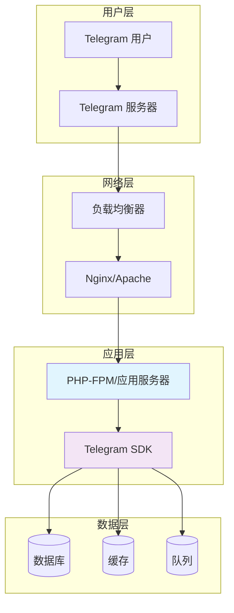

# 🚢 部署指南

本指南将详细介绍如何在不同环境中部署和运行 Telegram Bot PHP SDK。

## 🎯 部署概览

### 部署架构



### 部署方式选择

| 部署方式 | 适用场景 | 复杂度 | 性能 | 成本 |
|----------|----------|---------|------|------|
| 共享主机 | 个人项目、测试 | 低 | 低 | 低 |
| VPS/云服务器 | 中小项目 | 中 | 中 | 中 |
| 容器化部署 | 现代应用 | 中 | 高 | 中 |
| 无服务器 | 轻量级 Bot | 低 | 变动 | 按使用付费 |
| 集群部署 | 大型应用 | 高 | 极高 | 高 |

## 🖥️ 传统服务器部署

### 1. 系统要求

#### 最低要求
- **操作系统**: Linux (Ubuntu 20.04+, CentOS 8+)
- **PHP**: 8.3 或更高版本
- **内存**: 512MB+
- **存储**: 10GB+
- **网络**: 稳定的互联网连接

#### 推荐配置
- **操作系统**: Ubuntu 22.04 LTS
- **PHP**: 8.3 (最新版本)
- **内存**: 2GB+
- **存储**: 50GB+ SSD
- **CPU**: 2 核心+

### 2. 环境准备

#### Ubuntu/Debian 系统

```bash
# 更新系统
sudo apt update && sudo apt upgrade -y

# 安装 PHP 8.3 和必需扩展
sudo apt install -y software-properties-common
sudo add-apt-repository ppa:ondrej/php
sudo apt update

sudo apt install -y \
    php8.3 \
    php8.3-cli \
    php8.3-fpm \
    php8.3-curl \
    php8.3-json \
    php8.3-mbstring \
    php8.3-xml \
    php8.3-zip \
    php8.3-opcache \
    php8.3-redis \
    php8.3-mysql \
    composer \
    nginx \
    redis-server \
    mysql-server

# 启动服务
sudo systemctl enable nginx php8.3-fpm redis-server mysql
sudo systemctl start nginx php8.3-fpm redis-server mysql
```

#### CentOS/RHEL 系统

```bash
# 安装 EPEL 和 Remi 仓库
sudo dnf install -y epel-release
sudo dnf install -y https://rpms.remirepo.net/enterprise/remi-release-8.rpm

# 启用 PHP 8.3
sudo dnf module reset php
sudo dnf module enable php:remi-8.3

# 安装软件包
sudo dnf install -y \
    php \
    php-cli \
    php-fpm \
    php-curl \
    php-json \
    php-mbstring \
    php-xml \
    php-zip \
    php-opcache \
    php-redis \
    php-mysqlnd \
    composer \
    nginx \
    redis \
    mysql-server

# 启动服务
sudo systemctl enable nginx php-fpm redis mysqld
sudo systemctl start nginx php-fpm redis mysqld
```

### 3. 项目部署

#### 创建项目目录

```bash
# 创建应用目录
sudo mkdir -p /var/www/telegram-bot
sudo chown -R $USER:www-data /var/www/telegram-bot
cd /var/www/telegram-bot

# 创建基本结构
mkdir -p {storage/logs,bootstrap/cache,config,public}
```

#### 安装项目

```bash
# 使用 Composer 创建项目
composer create-project laravel/laravel . --prefer-dist

# 或者克隆现有项目
git clone https://github.com/your-username/your-bot-project.git .
composer install --no-dev --optimize-autoloader

# 安装 Telegram SDK
composer require xbot-my/telegram-sdk
```

#### 配置权限

```bash
# 设置正确的权限
sudo chown -R www-data:www-data /var/www/telegram-bot
sudo chmod -R 755 /var/www/telegram-bot
sudo chmod -R 775 /var/www/telegram-bot/storage
sudo chmod -R 775 /var/www/telegram-bot/bootstrap/cache
```

### 4. Nginx 配置

创建 Nginx 虚拟主机配置：

```nginx
# /etc/nginx/sites-available/telegram-bot
server {
    listen 80;
    server_name your-domain.com;
    root /var/www/telegram-bot/public;
    index index.php;

    # 安全头部
    add_header X-Frame-Options "SAMEORIGIN" always;
    add_header X-XSS-Protection "1; mode=block" always;
    add_header X-Content-Type-Options "nosniff" always;
    add_header Referrer-Policy "no-referrer-when-downgrade" always;
    add_header Content-Security-Policy "default-src 'self' http: https: data: blob: 'unsafe-inline'" always;

    # Gzip 压缩
    gzip on;
    gzip_vary on;
    gzip_min_length 1024;
    gzip_types
        text/plain
        text/css
        text/xml
        text/javascript
        application/json
        application/javascript
        application/xml+rss
        application/atom+xml
        image/svg+xml;

    location / {
        try_files $uri $uri/ /index.php?$query_string;
    }

    location = /favicon.ico { access_log off; log_not_found off; }
    location = /robots.txt  { access_log off; log_not_found off; }

    # Telegram Webhook 特殊配置
    location /telegram/webhook {
        try_files $uri $uri/ /index.php?$query_string;
        
        # 限制访问（仅允许 Telegram IP）
        allow 149.154.160.0/20;
        allow 91.108.4.0/22;
        allow 91.108.56.0/22;
        allow 91.108.8.0/22;
        deny all;
        
        # 速率限制
        limit_req zone=webhook burst=10 nodelay;
    }

    location ~ \.php$ {
        fastcgi_pass unix:/var/run/php/php8.3-fpm.sock;
        fastcgi_param SCRIPT_FILENAME $realpath_root$fastcgi_script_name;
        include fastcgi_params;
        
        # 增加超时时间
        fastcgi_read_timeout 300;
        fastcgi_send_timeout 300;
    }

    location ~ /\.(?!well-known).* {
        deny all;
    }
    
    # 日志配置
    access_log /var/log/nginx/telegram-bot.access.log;
    error_log /var/log/nginx/telegram-bot.error.log;
}

# 速率限制配置（添加到 http 块）
http {
    limit_req_zone $binary_remote_addr zone=webhook:10m rate=30r/m;
}
```

#### 启用站点

```bash
# 创建软链接
sudo ln -s /etc/nginx/sites-available/telegram-bot /etc/nginx/sites-enabled/

# 测试配置
sudo nginx -t

# 重启 Nginx
sudo systemctl restart nginx
```

### 5. SSL/HTTPS 配置

#### 使用 Let's Encrypt

```bash
# 安装 Certbot
sudo apt install certbot python3-certbot-nginx

# 获取证书
sudo certbot --nginx -d your-domain.com

# 自动续期
sudo crontab -e
# 添加: 0 12 * * * /usr/bin/certbot renew --quiet
```

#### 更新 Nginx 配置

```nginx
server {
    listen 443 ssl http2;
    server_name your-domain.com;
    
    ssl_certificate /etc/letsencrypt/live/your-domain.com/fullchain.pem;
    ssl_certificate_key /etc/letsencrypt/live/your-domain.com/privkey.pem;
    
    # SSL 安全配置
    ssl_protocols TLSv1.2 TLSv1.3;
    ssl_ciphers ECDHE-RSA-AES256-GCM-SHA512:DHE-RSA-AES256-GCM-SHA512;
    ssl_prefer_server_ciphers off;
    ssl_session_cache shared:SSL:10m;
    ssl_session_timeout 10m;
    
    # HSTS
    add_header Strict-Transport-Security "max-age=63072000" always;
    
    # 其他配置...
}

# HTTP 重定向到 HTTPS
server {
    listen 80;
    server_name your-domain.com;
    return 301 https://$server_name$request_uri;
}
```

## 🐳 Docker 容器部署

### 1. Dockerfile

创建优化的 Dockerfile：

```dockerfile
# Dockerfile
FROM php:8.3-fpm-alpine

# 安装系统依赖
RUN apk add --no-cache \
    nginx \
    supervisor \
    curl \
    zip \
    unzip \
    git \
    redis

# 安装 PHP 扩展
RUN docker-php-ext-install \
    pdo_mysql \
    opcache \
    pcntl

# 安装 Redis 扩展
RUN pecl install redis && docker-php-ext-enable redis

# 安装 Composer
COPY --from=composer:latest /usr/bin/composer /usr/bin/composer

# 创建应用目录
WORKDIR /var/www/html

# 复制应用文件
COPY . /var/www/html

# 安装依赖
RUN composer install --no-dev --optimize-autoloader --no-interaction

# 设置权限
RUN chown -R www-data:www-data /var/www/html \
    && chmod -R 755 /var/www/html \
    && chmod -R 775 /var/www/html/storage \
    && chmod -R 775 /var/www/html/bootstrap/cache

# 复制配置文件
COPY docker/nginx.conf /etc/nginx/nginx.conf
COPY docker/php-fpm.conf /usr/local/etc/php-fpm.d/www.conf
COPY docker/supervisord.conf /etc/supervisor/conf.d/supervisord.conf

# 暴露端口
EXPOSE 80

# 启动服务
CMD ["/usr/bin/supervisord", "-c", "/etc/supervisor/conf.d/supervisord.conf"]
```

### 2. Docker Compose

```yaml
# docker-compose.yml
version: '3.8'

services:
  app:
    build: .
    container_name: telegram-bot-app
    restart: unless-stopped
    working_dir: /var/www/html
    volumes:
      - ./:/var/www/html
      - ./storage/logs:/var/www/html/storage/logs
    environment:
      - APP_ENV=production
      - DB_CONNECTION=mysql
      - DB_HOST=db
      - DB_DATABASE=telegram_bot
      - DB_USERNAME=telegram_user
      - DB_PASSWORD=secure_password
      - REDIS_HOST=redis
    depends_on:
      - db
      - redis
    networks:
      - telegram-network

  nginx:
    image: nginx:alpine
    container_name: telegram-bot-nginx
    restart: unless-stopped
    ports:
      - "80:80"
      - "443:443"
    volumes:
      - ./:/var/www/html
      - ./docker/nginx.conf:/etc/nginx/nginx.conf
      - ./docker/ssl:/etc/nginx/ssl
    depends_on:
      - app
    networks:
      - telegram-network

  db:
    image: mysql:8.0
    container_name: telegram-bot-db
    restart: unless-stopped
    environment:
      MYSQL_DATABASE: telegram_bot
      MYSQL_USER: telegram_user
      MYSQL_PASSWORD: secure_password
      MYSQL_ROOT_PASSWORD: root_password
    volumes:
      - db_data:/var/lib/mysql
    networks:
      - telegram-network

  redis:
    image: redis:7-alpine
    container_name: telegram-bot-redis
    restart: unless-stopped
    command: redis-server --appendonly yes
    volumes:
      - redis_data:/data
    networks:
      - telegram-network

  queue:
    build: .
    container_name: telegram-bot-queue
    restart: unless-stopped
    command: php artisan queue:work --sleep=3 --tries=3
    working_dir: /var/www/html
    volumes:
      - ./:/var/www/html
    environment:
      - APP_ENV=production
      - DB_CONNECTION=mysql
      - DB_HOST=db
      - REDIS_HOST=redis
    depends_on:
      - db
      - redis
    networks:
      - telegram-network

volumes:
  db_data:
  redis_data:

networks:
  telegram-network:
    driver: bridge
```

### 3. 部署命令

```bash
# 构建和启动
docker-compose up -d --build

# 查看日志
docker-compose logs -f

# 进入容器
docker-compose exec app bash

# 停止服务
docker-compose down

# 更新应用
docker-compose exec app composer install --no-dev
docker-compose exec app php artisan config:cache
docker-compose restart app
```

## ☁️ 云平台部署

### 1. AWS 部署

#### 使用 AWS Elastic Beanstalk

```bash
# 安装 EB CLI
pip install awsebcli

# 初始化项目
eb init telegram-bot --platform "PHP 8.3 running on 64bit Amazon Linux 2"

# 创建环境
eb create production --database --database.engine mysql

# 部署应用
eb deploy

# 查看状态
eb status
eb logs
```

#### .ebextensions 配置

```yaml
# .ebextensions/01_packages.config
packages:
  yum:
    redis: []

# .ebextensions/02_php.config
option_settings:
  aws:elasticbeanstalk:container:php:phpini:
    document_root: /public
    memory_limit: 256M
    zlib.output_compression: "Off"
    allow_url_fopen: "On"
    display_errors: "Off"
    max_execution_time: 60
    upload_max_filesize: 10M
    post_max_size: 10M

# .ebextensions/03_nginx.config
files:
  "/etc/nginx/conf.d/telegram.conf":
    mode: "000644"
    owner: root
    group: root
    content: |
      location /telegram/webhook {
        allow 149.154.160.0/20;
        allow 91.108.4.0/22;
        deny all;
        try_files $uri $uri/ /index.php?$query_string;
      }
```

### 2. DigitalOcean 部署

#### 使用 App Platform

```yaml
# .do/app.yaml
name: telegram-bot
services:
- name: web
  source_dir: /
  github:
    repo: your-username/telegram-bot
    branch: main
  run_command: heroku-php-apache2 public/
  environment_slug: php
  instance_count: 1
  instance_size_slug: basic-xxs
  envs:
  - key: APP_ENV
    value: production
  - key: TELEGRAM_MAIN_BOT_TOKEN
    value: YOUR_BOT_TOKEN
    type: SECRET
  - key: DATABASE_URL
    value: ${db.DATABASE_URL}

databases:
- name: db
  engine: PG
  num_nodes: 1
  size: basic-xs
  version: "13"

workers:
- name: queue
  source_dir: /
  run_command: php artisan queue:work
  instance_count: 1
  instance_size_slug: basic-xxs
```

### 3. Google Cloud Platform 部署

#### 使用 Cloud Run

```yaml
# cloudbuild.yaml
steps:
- name: 'gcr.io/cloud-builders/docker'
  args: ['build', '-t', 'gcr.io/$PROJECT_ID/telegram-bot', '.']
- name: 'gcr.io/cloud-builders/docker'
  args: ['push', 'gcr.io/$PROJECT_ID/telegram-bot']
- name: 'gcr.io/cloud-builders/gcloud'
  args:
  - 'run'
  - 'deploy'
  - 'telegram-bot'
  - '--image=gcr.io/$PROJECT_ID/telegram-bot'
  - '--region=asia-east1'
  - '--platform=managed'
  - '--allow-unauthenticated'
```

## 🚀 性能优化

### 1. PHP 优化

#### PHP-FPM 配置

```ini
; /etc/php/8.3/fpm/pool.d/www.conf
[www]
user = www-data
group = www-data
listen = /run/php/php8.3-fpm.sock
listen.owner = www-data
listen.group = www-data

; 进程管理
pm = dynamic
pm.max_children = 50
pm.start_servers = 20
pm.min_spare_servers = 10
pm.max_spare_servers = 30
pm.max_requests = 1000

; 性能调优
request_terminate_timeout = 60
request_slowlog_timeout = 10
slowlog = /var/log/php8.3-fpm.log.slow

; 内存限制
php_admin_value[memory_limit] = 256M
php_admin_value[max_execution_time] = 60
```

#### OPcache 配置

```ini
; /etc/php/8.3/mods-available/opcache.ini
zend_extension=opcache.so

opcache.enable=1
opcache.enable_cli=1
opcache.memory_consumption=256
opcache.interned_strings_buffer=8
opcache.max_accelerated_files=10000
opcache.revalidate_freq=2
opcache.fast_shutdown=1
opcache.save_comments=1
opcache.validate_timestamps=0  ; 生产环境设为 0
```

### 2. 数据库优化

```sql
-- MySQL 配置优化
[mysqld]
innodb_buffer_pool_size = 1G
innodb_log_file_size = 256M
innodb_flush_log_at_trx_commit = 2
innodb_flush_method = O_DIRECT

query_cache_type = 1
query_cache_size = 128M

max_connections = 200
thread_cache_size = 16

-- 创建索引
CREATE INDEX idx_chat_id ON messages(chat_id);
CREATE INDEX idx_created_at ON messages(created_at);
CREATE INDEX idx_user_id_chat_id ON user_chats(user_id, chat_id);
```

### 3. 缓存策略

```php
// Laravel 缓存配置
'redis' => [
    'client' => 'predis',
    'default' => [
        'host' => env('REDIS_HOST', '127.0.0.1'),
        'password' => env('REDIS_PASSWORD', null),
        'port' => env('REDIS_PORT', 6379),
        'database' => env('REDIS_DB', 0),
        'options' => [
            'prefix' => env('REDIS_PREFIX', 'telegram:'),
            'compression' => 'gzip',
            'serializer' => 'igbinary',
        ],
    ],
    'cache' => [
        'host' => env('REDIS_HOST', '127.0.0.1'),
        'password' => env('REDIS_PASSWORD', null),
        'port' => env('REDIS_PORT', 6379),
        'database' => env('REDIS_CACHE_DB', 1),
    ],
    'session' => [
        'host' => env('REDIS_HOST', '127.0.0.1'),
        'password' => env('REDIS_PASSWORD', null),
        'port' => env('REDIS_PORT', 6379),
        'database' => env('REDIS_SESSION_DB', 2),
    ],
],
```

## 📊 监控和日志

### 1. 日志配置

```php
// config/logging.php
'channels' => [
    'telegram' => [
        'driver' => 'daily',
        'path' => storage_path('logs/telegram.log'),
        'level' => env('LOG_LEVEL', 'debug'),
        'days' => 14,
        'permission' => 0664,
    ],
    
    'webhook' => [
        'driver' => 'daily',
        'path' => storage_path('logs/webhook.log'),
        'level' => 'info',
        'days' => 30,
    ],
    
    'performance' => [
        'driver' => 'daily',
        'path' => storage_path('logs/performance.log'),
        'level' => 'info',
        'days' => 7,
    ],
],
```

### 2. 监控脚本

```bash
#!/bin/bash
# monitor.sh

# 检查 Bot 健康状态
check_bot_health() {
    response=$(curl -s "https://api.telegram.org/bot${BOT_TOKEN}/getMe")
    if [[ $response == *'"ok":true'* ]]; then
        echo "✅ Bot 健康检查通过"
        return 0
    else
        echo "❌ Bot 健康检查失败"
        return 1
    fi
}

# 检查 Webhook 状态
check_webhook() {
    response=$(curl -s "https://api.telegram.org/bot${BOT_TOKEN}/getWebhookInfo")
    url=$(echo $response | jq -r '.result.url')
    echo "📡 当前 Webhook: $url"
}

# 检查队列状态
check_queue() {
    failed_jobs=$(php artisan queue:size)
    if [ $failed_jobs -gt 100 ]; then
        echo "⚠️  队列积压: $failed_jobs 个任务"
    else
        echo "✅ 队列正常: $failed_jobs 个任务"
    fi
}

# 主监控逻辑
main() {
    echo "🔍 开始监控检查 $(date)"
    check_bot_health
    check_webhook
    check_queue
    echo "✅ 监控检查完成"
}

main
```

### 3. 自动化部署脚本

```bash
#!/bin/bash
# deploy.sh

set -e

echo "🚀 开始部署..."

# 1. 拉取最新代码
git pull origin main

# 2. 安装依赖
composer install --no-dev --optimize-autoloader --no-interaction

# 3. 清除缓存
php artisan config:clear
php artisan route:clear
php artisan view:clear

# 4. 缓存配置
php artisan config:cache
php artisan route:cache
php artisan view:cache

# 5. 数据库迁移
php artisan migrate --force

# 6. 重启队列
php artisan queue:restart

# 7. 重启服务
sudo systemctl reload php8.3-fpm
sudo systemctl reload nginx

echo "✅ 部署完成！"

# 8. 健康检查
sleep 5
curl -f https://your-domain.com/health || exit 1

echo "🎉 部署成功！"
```

## 🔧 故障排除

### 常见部署问题

1. **权限问题**
   ```bash
   # 修复权限
   sudo chown -R www-data:www-data /var/www/telegram-bot
   sudo chmod -R 755 /var/www/telegram-bot
   sudo chmod -R 775 /var/www/telegram-bot/storage
   ```

2. **PHP 扩展缺失**
   ```bash
   # 检查扩展
   php -m | grep -E "(curl|json|mbstring)"
   
   # 安装缺失扩展
   sudo apt install php8.3-curl php8.3-json php8.3-mbstring
   ```

3. **内存不足**
   ```ini
   ; 增加内存限制
   memory_limit = 512M
   max_execution_time = 300
   ```

4. **SSL 证书问题**
   ```bash
   # 检查证书
   openssl s_client -connect your-domain.com:443
   
   # 更新证书
   sudo certbot renew
   ```

## 🔗 相关资源

- [Laravel 部署文档](https://laravel.com/docs/deployment)
- [Nginx 配置指南](https://nginx.org/en/docs/)
- [Docker 官方文档](https://docs.docker.com/)
- [AWS Elastic Beanstalk](https://aws.amazon.com/elasticbeanstalk/)

---

🎯 **部署成功后**，记得设置监控、备份和定期维护！